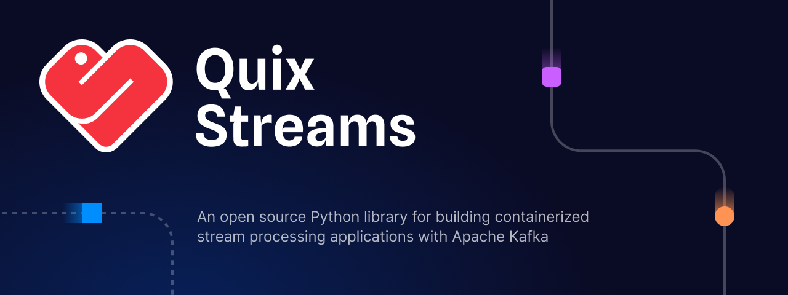

 [](https://github.com/quixio/quix-streams/releases)

[](https://quix.io/docs/quix-streams/introduction.html) \
[](https://quix.io/slack-invite)
[](https://www.youtube.com/@QuixStreams)
[](https://www.linkedin.com/company/70925173/)
[](https://twitter.com/quix_io)

# Open source Python framework for reliable data engineering

Quix Streams is an end-to-end framework for real-time Python data engineering, operational analytics and machine learning on Apache Kafka data streams. Extract, transform and load data reliably in fewer lines of code using your favourite Python libraries.

Build data pipelines and event-driven microservice architectures leveraging Kafka's low-level scalability, resiliency and durability features in a lightweight library without server-side clusters to manage.

Quix Streams provides the following features to make your life easier:
- Pure Python, meaning no wrappers around Java and no cross-language debugging.
- Sources & Sinks API for building custom connectors that integrate data with Kafka.
- Streaming DataFrame API for building tabular data processing pipelines.
- Serializers API supporting JSON, Avro, Protobuf & Schema Registry.
- State API with built-in RocksDB state object for stateful processing.
- Application API for managing the Kafka-related setup, teardown and message lifecycle.
- Operators for common processing tasks like Windowing, Branching, Group By and Reduce.
- Exactly-once processing guarantees via Kafka transactions.

Use Quix Streams to build simple Kafka producer/consumer applications or leverage stream processing to build complex event-driven systems, real-time data pipelines and AI/ML products.

## Getting Started 🏄

### Install Quix Streams

```shell
# PyPI
python -m pip install quixstreams

# or conda
conda install -c conda-forge quixio::quixstreams
```

#### Requirements
Python 3.9+, Apache Kafka 0.10+

See [requirements.txt](https://github.com/quixio/quix-streams/blob/main/requirements.txt) for the full list of requirements

### Documentation
[Quix Streams Docs](https://quix.io/docs/quix-streams/introduction.html)

### Example

Here's an example of how to <b>process</b> data from a Kafka Topic with Quix Streams:

```python
from quixstreams import Application

# A minimal application reading temperature data in Celsius from the Kafka topic,
# converting it to Fahrenheit and producing alerts to another topic.

# Define an application that will connect to Kafka
app = Application(
    broker_address="localhost:9092",  # Kafka broker address
)

# Define the Kafka topics
temperature_topic = app.topic("temperature-celsius", value_deserializer="json")
alerts_topic = app.topic("temperature-alerts", value_serializer="json")

# Create a Streaming DataFrame connected to the input Kafka topic
sdf = app.dataframe(topic=temperature_topic)

# Convert temperature to Fahrenheit by transforming the input message (with an anonymous or user-defined function)
sdf = sdf.apply(lambda value: {"temperature_F": (value["temperature"] * 9/5) + 32})

# Filter values above the threshold
sdf = sdf[sdf["temperature_F"] > 150]

# Produce alerts to the output topic
sdf = sdf.to_topic(alerts_topic)

# Run the streaming application (app automatically tracks the sdf!)
app.run()
```

### Tutorials

To see Quix Streams in action, check out the Quickstart and Tutorials in the docs: 

- [**Quickstart**](https://quix.io/docs/quix-streams/quickstart.html)
- [**Tutorial - Word Count**](https://quix.io/docs/quix-streams/tutorials/word-count/tutorial.html)
- [**Tutorial - Anomaly Detection**](https://quix.io/docs/quix-streams/tutorials/anomaly-detection/tutorial.html)
- [**Tutorial - Purchase Filtering**](https://quix.io/docs/quix-streams/tutorials/purchase-filtering/tutorial.html)


### Key Concepts
There are two primary objects:
- `StreamingDataFrame` - a predefined declarative pipeline to process and transform incoming messages.
- `Application` - to manage the Kafka-related setup, teardown and message lifecycle (consuming, committing). It processes each message with the dataframe you provide for it to run.

Under the hood, the `Application` will:
- Consume and deserialize messages.
- Process them with your `StreamingDataFrame`.
- Produce it to the output topic.
- Automatically checkpoint processed messages and state for resiliency.
- Scale using Kafka's built-in consumer groups mechanism.


### Deployment
You can run Quix Streams pipelines anywhere Python is installed.

Deploy to your own infrastructure or to [Quix Cloud](https://quix.io/product) on AWS, Azure, GCP or on-premise for a fully managed platform.  
You'll get self-service DevOps, CI/CD and monitoring, all built with best in class engineering practices learned from Formula 1 Racing.

Please see the [**Connecting to Quix Cloud**](https://quix.io/docs/quix-streams/quix-platform.html) page 
to learn how to use Quix Streams and Quix Cloud together.

## Roadmap 📍

This library is being actively developed by a full-time team.

Here are some of the planned improvements:

- [x] [Windowed aggregations over Tumbling & Hopping windows](https://quix.io/docs/quix-streams/windowing.html)
- [x] [Stateful operations and recovery based on Kafka changelog topics](https://quix.io/docs/quix-streams/advanced/stateful-processing.html)
- [x] [Group-by operation](https://quix.io/docs/quix-streams/groupby.html)
- [x] ["Exactly Once" delivery guarantees for Kafka message processing (AKA transactions)](https://quix.io/docs/quix-streams/configuration.html#processing-guarantees)
- [x] Support for [Avro](https://quix.io/docs/quix-streams/advanced/serialization.html#avro) and [Protobuf](https://quix.io/docs/quix-streams/advanced/serialization.html#protobuf) formats
- [x] [Schema Registry support](https://quix.io/docs/quix-streams/advanced/schema-registry.html)
- [x] [Windowed aggregations over Sliding windows](https://quix.io/docs/quix-streams/windowing.html)
- [ ] Joins

For a more detailed overview of the planned features, please look at [the Roadmap Board](https://github.com/orgs/quixio/projects/1).

## Get Involved 🤝

- Please use [GitHub issues](https://github.com/quixio/quix-streams/issues) to report bugs and suggest new features.
- Join the [Quix Community on Slack](https://quix.io/slack-invite), a vibrant group of Kafka Python developers, data engineers and newcomers to Apache Kafka, who are learning and leveraging Quix Streams for real-time data processing.
- Watch and subscribe to [@QuixStreams on YouTube](https://www.youtube.com/@QuixStreams) for code-along tutorials from scratch and interesting community highlights.
- Follow us on [X](https://x.com/Quix_io) and [LinkedIn](https://www.linkedin.com/company/70925173) where we share our latest tutorials, forthcoming community events and the occasional meme.
- If you have any questions or feedback - write to us at support@quix.io!


## License 📗

Quix Streams is licensed under the Apache 2.0 license.  
View a copy of the License file [here](https://github.com/quixio/quix-streams/blob/main/LICENSE).
