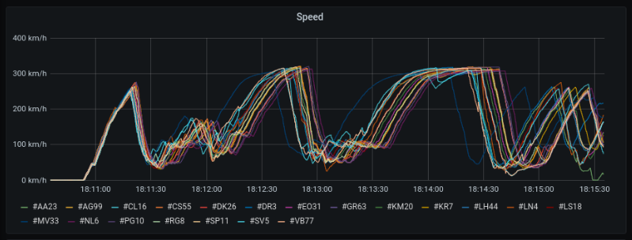

[//]: <> (This will be a banner image w/ the name e.g. Quix Streams.)

[](https://twitter.com/quix_io)
[](https://quix.io/slack-invite)
[](https://www.linkedin.com/company/70925173/)
[](https://quix.io/community#events)
[](https://www.youtube.com/channel/UCrijXvbQg67m9-le28c7rPA)
[](https://www.quix.io/docs/sdk/introduction.html)
[](https://github.com/orgs/quixai/projects/1)

# What is Quix Streams?

<b>Quix Streams</b> is a library for developing <b>real-time</b> streaming applications focused on <b>time-series data</b> and high-performance. It's designed to be used for high-frequency telemetry services when you need to process <b>high volumes</b> of time-series data with up to nanosecond precision. It uses a message broker such as <b>Apache Kafka</b>, instead of a database, so you can process time-series data with high performance and resource savings.

Quix Streams <b>does not use</b> any Domain Specific Language or Embedded framework, it's a library that you can use in your code base. This means you can use any data processing library for your chosen language ,together with Quix Streams.

Quix Streams currently supports the following languages:

- Python 
- C#

Quix Streams is [designed to be extended](#interoperability-wrappers) to multiple programming languages. 

Using Quix Streams, you can:

- Produce time-series and event data to a Kafka Topic.
- Consume time-series and event data from a Kafka Topic.
- Process data by consuming it from one Kafka Topic, process it, and then producing the results back to another Kafka Topic.
- Group data by Streams attaching metadata to them.

## What is time-series data?

Time-series data is a series of data points indexed in time order. Typically, time-series data is collected at regular intervals, such as days, hours, minutes, seconds, or milliseconds. In a data frame representation, each row of the data frame corresponds to a single time point, and each column contains a different variable or observation measured at that time point.

```
timestamp            value1   value2   value3   value4   value5   value6   value7
2022-01-01 01:20:00  25.3     10.1     32.3     56.2     15.3     12.2     27.1  
2022-01-01 01:20:01  26.2     11.2     31.2     55.1     16.2     13.1     28.2  
2022-01-01 01:20:02  24.1     12.3     30.1     54.3     17.1     14.2     29.1  
2022-01-01 01:20:03  23.4     13.4     29.2     53.2     18.3     15.3     30.2  
2022-01-01 01:20:04  22.6     14.5     28.3     52.1     19.2     16.2     31.1  
2022-01-01 01:20:05  22.4     14.6     28.1     52.8     19.2     16.4     31.1  
...                  ...      ...      ...      ...      ...      ...      ...   
```

Time-series data is often plotted on a graph with the x-axis representing the time at which the data was collected and the y-axis representing the value of the data point.



### High-frequency data

High-frequency data is a type of <b>time-series data</b> that is collected at a very high rate, often at intervals of less than a second. Because high-frequency data is collected at such a high rate, it can be difficult to analyze and visualize using traditional methods. As a result, specialized techniques and tools are often used to process and analyze high-frequency data.

Quix streams is a library specialized in processing <b>high-frequency data</b>, although it can be used to process and analyze any kind of time-series or non-timeseries data.

## Getting Started 🏄

### Installing the library on Intel

You can install the library for amd64 platforms using the package manager for Python Packages:

```shell
pip install --extra-index-url https://test.pypi.org/simple/ quixstreams==0.5.0.dev16 --user
```

### Installing on M1/M2 Mac

To install Quix Streams on apple silicon (M1 and M2-based) Macs, rosetta amd64 emulation is necessary at this time. Follow these instructions: 

1. To make sure you have Rosetta installed, open Mac Terminal, and run the command `softwareupdate --install-rosetta`.

2. If you don't have Brew installed, install it using the instructions on the [Brew homepage](https://brew.sh). Make sure that after the install script runs, that you perform any configuration recommended by the script.

3. Install an additional terminal, such as iTerm2. You could do this, for example, with `brew install iterm2`.

4. Open finder, go to Applications, and locate iTerm2.

5. Right-click the iTerm2 application icon to display the context-sensitive menu, and select the menu item `Duplicate`.

6. Rename the duplicate created to `iTerm2 rosetta`.

7. Right-click `iTerm2 rosetta` again and select `Get Info`.

8. Tick the `Open using rosetta` checkbox, so that iTerm2 is always opened using Rosetta.

9. Launch `iTerm2 rosetta` by double-clicking it.

10. On the command line, run the `arch` command. This will display `i386`. If not, check your steps so far.

11. Install Brew again. This installs a new copy of Brew to a new directory structure.

12. Open your Zsh profile file, `~/.zprofile`, using a text editor such as Nano. For example, with the command `nano ~/.zprofile`.

13. Add the following code to `~/.zprofile`:

    ```
    if [ $(arch) = "i386" ]; then
        alias brew="/usr/local/bin/brew"
    fi
    ```

    This will ensure that when you open `iTerm2 rosetta`, your `brew` command will point at the correct (x86_64) Brew installation.

14. Reload your Zsh profile by running `source ~/.zprofile`, or opening a new instance of `iTerm2 rosetta`.

15. Install Python with the command `brew install python3`.

16. Using log messages from `brew`, check where Python was installed, for example: `/usr/local/Cellar/python@3.10/3.10.9/bin/python3`.

17. Open your `~/.zprofile` file again, and add the following line inside the `if` statement:

    ```
    if [ $(arch) = "i386" ]; then
        ...
        alias python3="/usr/local/Cellar/python@3.10/3.10.9/bin/python3"
        ...
    fi
    ```

18. Reload your Zsh profile by running `source ~/.zprofile`, or by starting a new instance of `iTerm2 rosetta`.

19. Install Quix Streams:

    ```
    python3 -m pip install --extra-index-url https://test.pypi.org/simple/ quixstreams==0.5.0.dev16 --user
    ```

20. You can now run your code that uses Quix Streams:
    
    ```
    python3 yourcode.py
    ```

You have now successfully installed Quix Streams on M1/M2 architectures.

### Prepare your Kafka Cluster

This library needs to utilize a message broker to send and receive data. We use [Apache Kafka](https://kafka.apache.org/) because it is the leading message broker in the field of streaming data, with enough performance to support high volumes of time-series data, with minimum latency.

### Producing time-series data

Now you can start producing time-series data into a Kafka Topic. Here's an example of how to <b>produce</b> time-series data into a Kafka Topic with Python.

```python
import time
import datetime
import math

from quixstreams import KafkaStreamingClient

# Client connecting to Kafka instance locally without authentication. 
client = KafkaStreamingClient('127.0.0.1:9092')

# Open the output topic where to produce data to.
output_topic = client.open_output_topic("your-kafka-topic")

stream = output_topic.create_stream()
stream.properties.name = "Hello World python stream"
stream.properties.metadata["my-metadata"] = "my-metadata-value"
stream.parameters.buffer.time_span_in_milliseconds = 100   # Send data in 100 ms chunks

print("Sending values for 30 seconds.")

for index in range(0, 3000):
    stream.parameters \
        .buffer \
        .add_timestamp(datetime.datetime.utcnow()) \
        .add_value("ParameterA", math.sin(index / 200.0)) \
        .add_value("ParameterB", "string value: " + str(index)) \
        .add_value("ParameterC", bytearray.fromhex("51 55 49 58")) \
        .write()
    time.sleep(0.01)

print("Closing stream")
stream.close()
```

### Consuming time-series data

Once we have setup our producer, it's time to see how to consume data from a topic. Here's an example of how to <b>consume</b> time-series data from a Kafka Topic with Python:

```python
import pandas as pd

from quixstreams import *
from quixstreams.app import App

# Client connecting to Kafka instance locally without authentication. 
client = KafkaStreamingClient('127.0.0.1:9092')

# Open the input topic where to consume data from.
# For testing purposes we remove consumer group and always read from latest data.
input_topic = client.open_input_topic("your-kafka-topic", consumer_group=None, auto_offset_reset=AutoOffsetReset.Latest)

# consume streams
def on_stream(input_stream: StreamReader):

    # consume data (as Pandas DataFrame)
    def on_read_pandas(df: pd.DataFrame):
        print(df.to_string())

    input_stream.parameters.on_read_pandas += on_read_pandas

# Hook up events before initiating read to avoid losing out on any data
input_topic.on_stream_received += on_stream

print("Listening to streams. Press CTRL-C to exit.")
# Handle graceful exit
App.run()
```

Quix Streams allows multiple configurations to leverage resources while consuming and producing data from a Topic depending on the use case, frequency, language, and data types. 

For full documentation of how to [<b>consume</b>](https://www.quix.io/docs/sdk/read.html) and [<b>produce</b>](https://www.quix.io/docs/sdk/write.html) time-series and event data with Quix Streams, [visit our docs](https://www.quix.io/docs/sdk/introduction.html).

## Library features

This library provides several features and solves common problems you face when developing real-time streaming applications. 

- <b>Stream context</b>: Quix Streams handles stream contexts for you, so all the data from one data source is bundled in the same scope. It let's you produce <b>multiple streams</b> through the same topic and enables the message broker to <b>parallelize loads</b> reliably across multiple consumers. 

- <b>Stream metadata</b>: Quix Streams allows you to attached metadata to a Stream context and to the definition of Parameters and Events. The library manages the <b>metadata communication</b> behind the scenes, only sending and receiving it when necessary to improve efficiency.

- <b>Time-series data serialization and de-serialization</b>: Quix Streams serializes and deserializes time-series data using different codecs and optimizations to <b>minimize payloads</b> in order to increase throughtput and reduce latency.

- <b>No schema registry needed</b>: Quix Streams doesn't need a schema registry to send different set of types or parameters, this is handled internally by the protocol. This means that you can send <b>more than one schema per topic</b>.

- <b>Built-in time-series buffers</b>: If you’re sending data at <b>high frequency</b>, processing each message can be costly. The library provides built-in time-series buffers for producing and consuming, allowing several configurations for balancing between latency and cost.

- <b>Support for data frames</b>: In many use cases, multiple time-series parameters are emitted at the same time, so they share one timestamp. Handling this data independently is wasteful. The library uses a tabular system that can work for instance with <b>Pandas DataFrames</b> natively. Each row has a timestamp and <b>user-defined tags</b> as indexes.

- <b>Multiple data types</b>: This library allows you to produce and consume different types of mixed data in the same timestamp, like <b>Numbers</b>, <b>Strings</b> or <b>Binary data</b>.

- <b>Message splitting</b>: Quix Streams automatically handles <b>large messages</b> on the producer side, splitting them up if required. You no longer need to worry about Kafka message limits. On the consumer side, those messages are automatically merged back.

- <b>Message Broker configuration</b>: Many configuration settings are needed to use Kafka at its best, and the ideal configuration takes time. The library take care of Kafka configuration by default allowing refined configuration only when needed.

- <b>Checkpointing</b>: Quix Streams allows manual or automatic checkpointing when you consume data from a Kafka Topic. This provides the ability to inform the Message Broker that you have already processed messages up to one point.

- <b>Horizontal scaling</b>: Quix Streams handles horizontal scaling using the streaming context feature. You can scale the processing services, from one replica to many and back to one, and the library ensures that the data load is always shared between your replicas reliably.

For a detailed overview of features, [visit our docs.](https://www.quix.io/docs/sdk/introduction.html)

### Coming soon

This library is actively in developing process. We have some features planned in the [road map](https://github.com/orgs/quixai/projects/1) of the library coming soon:

(WIP)

## Library architecture notes

### Interoperability wrappers

The Quix Streams base library is developed in C#. We use Interoperability wrappers around <b>C# AoT (Ahead of Time) compiled code</b> to implement support for other languages such as <b>Python</b>. These Interop wrappers are auto-generated using a project called `InteropGenerator` included in the same repository. Ahead-of-time native compilation was a feature introduced officially on .NET 7. Learn more [here](https://learn.microsoft.com/en-us/dotnet/core/deploying/native-aot/).

You can generate these Wrappers again using the `shell scripts` provided for each platform inside the language-specific client. For instance for Python:

- `/Python/buildwindows.bat`: Generates Python Interop wrappers for Windows platform.
- `/Python/buildlinux.sh`: Generates Python Interop wrappers for Linux platform.

These scripts compile the C# base library and then use the `InteropGenerator` project to generate the AoT compiled version of the library and the Interops wrappers around that. The result is a structure like this:

```

   ┌───────────────────────────┐
   │   Python client library   │    /Python/lib/quixstreams
   └─────────────┬─────────────┘
                 │
                 │
   ┌─────────────▼─────────────┐
   │  Python Interop wrapper   │    /Python/lib/quixstreams/native/Python  (auto-generated)
   └─────────────┬─────────────┘
                 │
                 │
   ┌─────────────▼─────────────┐
   │  C# AoT compiled library  │    /Python/lib/quixstreams/native/win64   (auto-generated)
   └───────────────────────────┘

```

The non auto-generated `Python client library` still needs to be maintained manually, but this is expected because each language has its own language-specific features and naming conventions that we want to keep aligned with the language user expectations. If you want to add a new feature of the library that is common to all the languages, you should implement that feature in the C# base library first, re-generate the Interop wrappers, and then modify the Python client library to wire up the new feature of the base library.

### Base library

Quix Streams base library is implemented in C#, therefore if your target language is C#, you will use that base library without any [Interoperability wrapper](#interoperability-wrappers) involved on the execution. 

This base library is organized in 3 main layers:

```

   ┌───────────────────────────┐
   │      Streaming layer      │    /CSharp/Quix.Streams.Streaming
   └─────────────┬─────────────┘
                 │
                 │
   ┌─────────────▼─────────────┐
   │      Telemetry layer      │    /CSharp/Quix.Streams.Telemetry
   └─────────────┬─────────────┘
                 │
                 │
   ┌─────────────▼─────────────┐
   │   Kafka Transport layer   │    /CSharp/Quix.Streams.Transport.Kafka
   ├───────────────────────────┤
   │      Transport layer      │    /CSharp/Quix.Streams.Transport
   └───────────────────────────┘

```

Each layer has his own responsibilities:
 
- <b>Streaming layer</b>: This is the main layer of the library that users should use by default. It includes all the <b>syntax sugar</b> needed to have a pleasant experience with the library. Another important responsibility of this layer is the <b>embedded time-series buffer</b> system.

- <b>Telemetry layer</b>: This layer is responsible for implementing the `Codecs` serialization and de-serialization for all the <b>Telemetry messages</b> of the Quix Streams protocol. This includes time-series and non time-series messages, stream metadata, stream properties messages, parameters definitions, as well as creating the [Stream context](#library-features-) scopes responsible for the separation between data coming from different sources. This layer also implements a `Stream Process` system to concatenate different Stream processes that can be used to implement complex low-level Telemetry services.

- <b>Transport layer</b>: This layer is responsible for the <b>communication with the message broker</b> and implementing some features to deal with the message broker's features and limitations. Some of these features are `message splitting`, `checkpointing`, `partition revokation`, `connectivity issues recovering` among others. This layer is also responsible for implementing a `wrapping messages system` to allow different message types of the library Protocol, and to define the base classes for the `Codecs` implementation of each messages of that Protocol on the upper layers of the library. For <b>Kafka</b> support, this base library uses internally [Confluent .NET Client for Apache Kafka](https://github.com/confluentinc/confluent-kafka-dotnet), which uses the library [librdkafka - the Apache Kafka C/C++ client library](https://github.com/edenhill/librdkafka).

For more information and general questions about the architecture of the library you can join to our official [Slack channel](https://quix.io/slack-invite).

## Using Quix Streams with Quix SaaS platform

This library doesn't have any dependency on any commercial product, but if you use it together with [Quix SaaS platform](https://www.quix.io) you will get some advantages out of the box during your development process such as auto-configuration, monitoring, data explorer, data persistence, pipeline visualization, metrics, and more.

## Contribution Guide

Contributing is a great way to learn and we especially welcome those who haven't contributed to an OSS project before. We're very open to any feedback or code contributions to this OSS project ❤️. Before contributing, please read our [Contributing File](https://github.com/quixai/quix-streams/blob/main/CONTRIBUTING.md) for how you can best give feedback and contribute. 

## Need help?

If you run into any problems, ask on #quix-help in [The Stream Slack channel](https://quix.io/slack-invite), alternatively create an [issue](https://github.com/quixai/quix-streams/issues)

## Roadmap

You can view and contribute to our feature [roadmap](https://github.com/orgs/quixai/projects/1).

## Community 👭

Join other software engineers in [The Stream](https://quix.io/slack-invite), an online community of people interested in all things data streaming. This is a space to both listen to and share learnings.

🙌  [Join our Slack community!](https://quix.io/slack-invite)

## License

Quix Streams is licensed under the Apache 2.0 license. View a copy of the License file [here](https://github.com/quixai/quix-streams/blob/main/LICENSE).

## Stay in touch 👋

You can follow us on [Twitter](https://twitter.com/quix_io) and [Linkedin](https://www.linkedin.com/company/70925173) where we share our latest tutorials, forthcoming community events and the occasional meme.  

If you have any questions or feedback - write to us at support@quix.ai!
