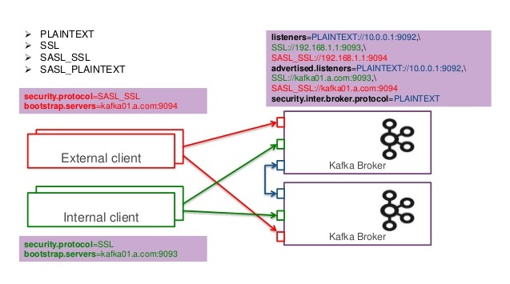

# Broker configuration

Message Broker configurations are not an easy part of setting up a new
streaming infrastructure. For instance, [Kafka
configuration](https://kafka.apache.org/documentation/#configuration)
has more than 500 different properties across Server, Topic, Consumer
and Producer configurations.

Quix handles Kafka configuration efficiently and reliably. We maintain
these configurations in order to achieve the best performance and
reliability when using the Quix SDK together with managed Kafka topics
created inside Quix workspaces.

In addition, the Quix SDK uses high-security connections using SSL
certificates that encrypt all your data between producers and consumers.
These types of secured connection require some complex configuration in
the Broker and Client side. We take care of this in the SDK so you don’t
have to.

Our templates come with pre-configured client certificates and
connection settings, so you don’t need to worry about this configuration
complexity.

Refer to the [Connecting to Quix](#../connect.md) section for more
information.
