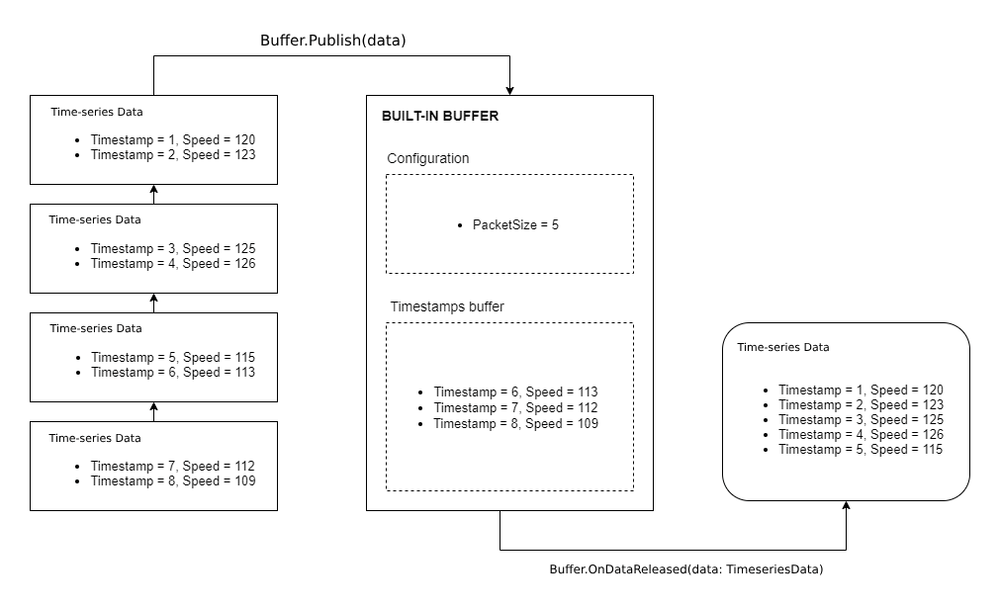

# Built-in buffers

If you’re sending data at a high frequency, processing time-series
without any buffering involved can be very costly. With smaller
messages, data compression cannot be implemented as efficiently. The
time spent in serializing and deserializing messages is too high to do
it at very high rates.

On the other hand, an incorrect buffer strategy can introduce high
latency values between extremes, that could be not acceptable in some
use cases.

The Quix SDK provides you with a very high performance, low latency
buffer, combined with easy-to-use configurations for
[reading](../../read/#buffer) and [writing](../../write/#buffer)
to give you absolute freedom in balancing between latency and cost.

Buffers in the Quix SDK work at the timestamp level. A buffer
accumulates certain timestamps with their related values. A packet
containing those timestamps and values as a
[ParameterData](../../read/#parameter-data-format) package is then
released when certain configured conditions match.

The logic looks simple, but it’s actually quite complicated when you try
to reach a very high performance level, creating at the same time an
easy interface for [reading](../../read/#buffer) and
[writing](../../write/#buffer) time-series data.

Our buffer implementation uses short memory allocations and minimizes
conversions between raw transport packages and
[ParameterData](../../read/#parameter-data-format) format to achieve
low CPU and memory consumption, and high throughput. We are happy to say
that we have achieved these three things in the SDK — simplicity, low
resource consumption, and very high performance — and you don’t need to
even worry about buffering because it’s provided in the SDK.
