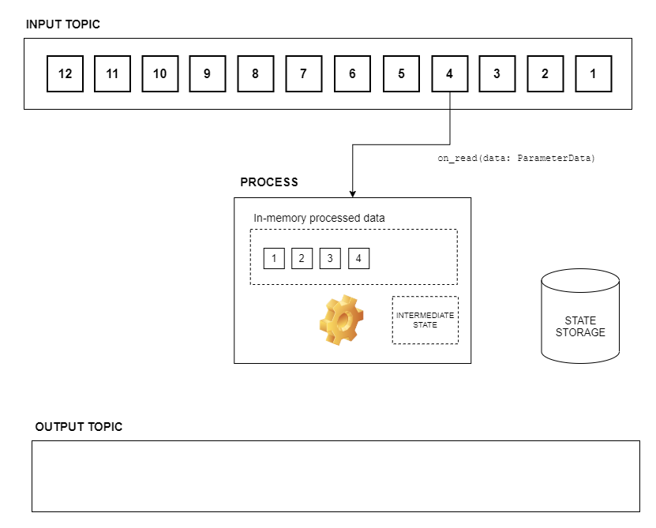
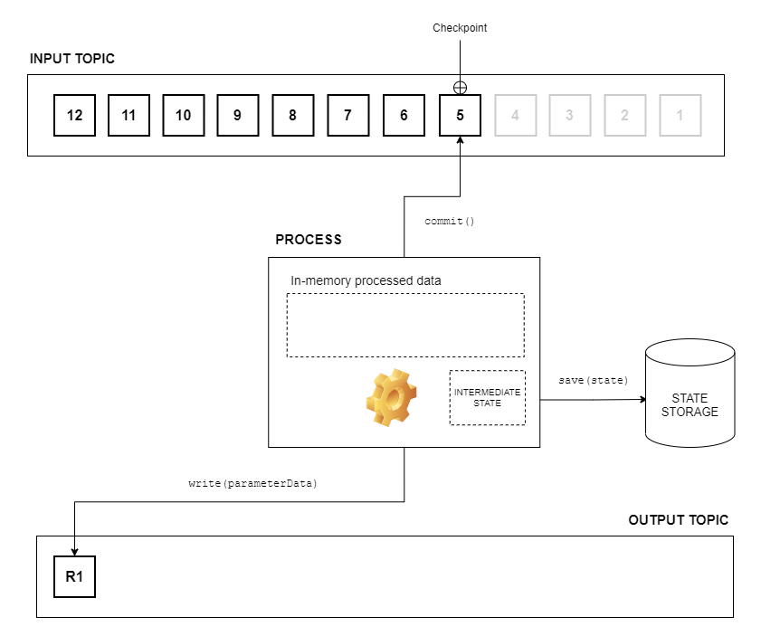
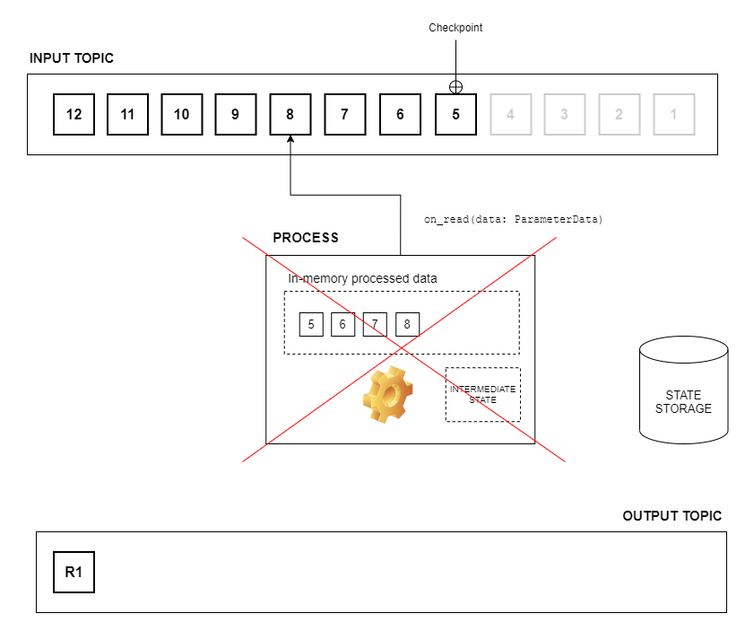
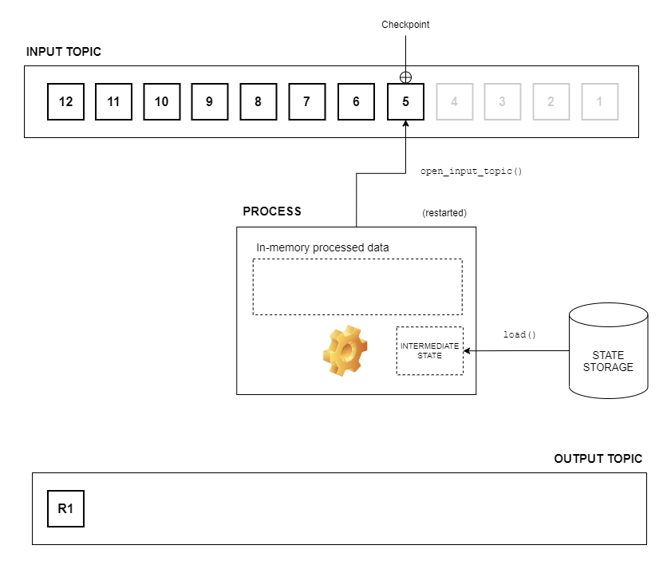
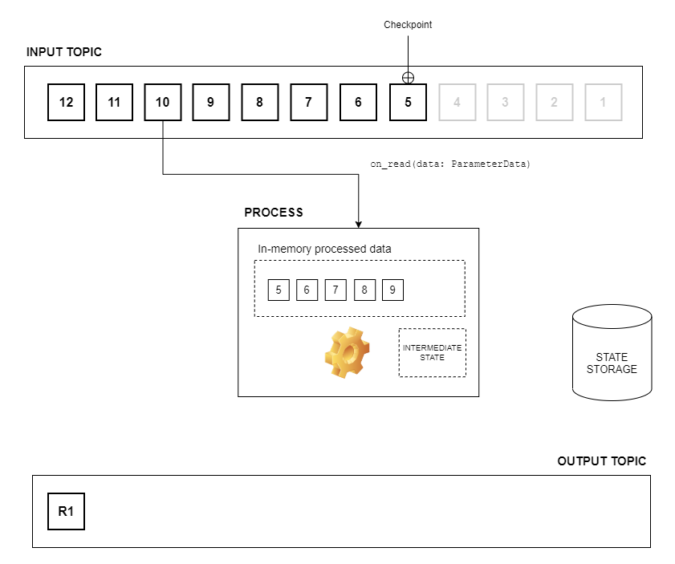
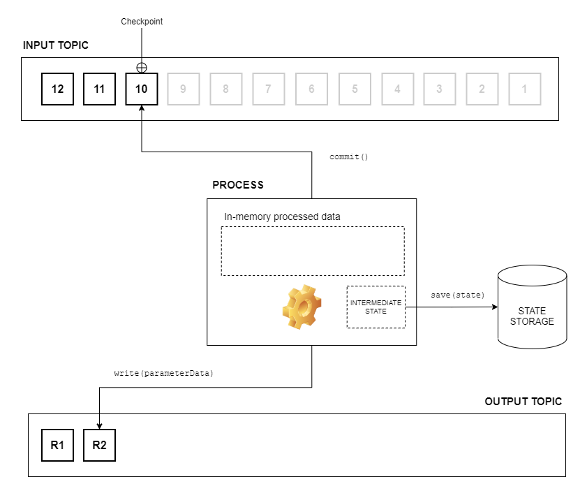

# Checkpointing

Quix Streams enables you to do manual checkpointing when you read data from a topic. You can then notify the message broker that you have processed messages up to a point, usually called a **checkpoint**.

This is a very important concept when you are developing high-performance, streaming applications, processing lots of data in memory. You don’t want to persist a state for each message received because it would cause an unaffordable processing cost, slowing down your streaming speeds and overall performance.

Checkpointing enables you to do some of this costly processing at a lower frequency, without having to worry about losing data. If, for some reason, your process is restarted or crashes and you haven’t saved all the in-memory data, when you reconnect to the topic the message broker resends all messages from the last checkpoint.

Refer to the [committing / checkpointing](../subscribe.md#committing-checkpointing) section of this documentation to find out how to do checkpointing when reading data with the library.

## Checkpointing example

The following provides an example of how checkpointing works.

One process is reading and processing data, without saving its state after each message is received. This allows good performance and high throughput of the service but, without checkpointing, risks data loss in the case of failure.

1. The process reads the first four messages, keeping its state in memory:
    
    

2. The process commits the messages of the topic (checkpointing) just after reading the first four and saves the in-memory state to the database:
    
    

3. The process reads the next four messages, but it crashes just after that, without time to commit the messages. There is no data loss because the process begins reading from the last checkpoint after it restarts:
    
    

4. The process restarts and reopens the input topic. It will start reading messages from the last checkpoint resulting in no data loss from the previous crash:
    
    

5. The process resumes reading the next five messages, keeping its state in memory:
    
    

6. The process commits the messages of the topic just after reading the previous five messages and saves the in-memory state to the database:
    
    
