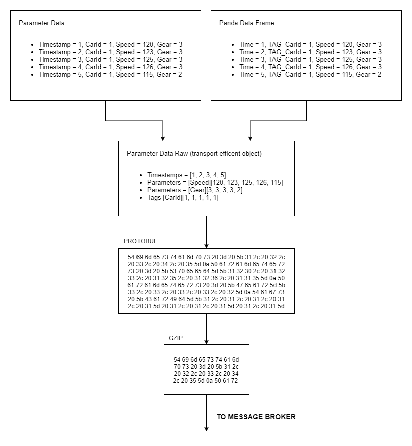

# Data serialization

Serialization can be difficult, especially if it’s done with performance in mind. Quix Streams serializes and deserializes [TimeseriesData](../subscribe.md#timeseriesdata-format) transport objects, which was created specifically to be efficient with time series data. Codecs such as Protobuf are also used to significantly improve overall performance of the serialization and deserialization process.



Quix Streams automatically serializes data from your language's built in types. You can work with familiar types, such as [pandas DataFrame](https://pandas.pydata.org/docs/user_guide/dsintro.html#dataframe), or use the Quix [TimeseriesData](../subscribe.md#timeseriesdata-format) type, and leave the library to perform any type conversions required.

The `CodecSettings` class allows us to change the message codec type, a way of encoding and decoding messages.

There are three supported types of codecs:

1. `Json`: The default codec type.
2. `CompactJsonForBetterPerformance`: This is a more lightweight version of JSON. It produces JSON that may be a bit less readable by a human, but it results in smaller message sizes, which can lead to improved performance.
3. `Protobuf`: This provides efficient binary serialization for messages, offering superior performance and reduced message size. However, the resulting data is not human-readable.

Message codec type can be changes like so (with C#):

```csharp
CodecSettings.SetGlobalCodecType(CodecType.Protobuf);
```

It can be done in Python as well:

```python
CodecSettings.set_global_codec_type(CodecType.Protobuf)
```

After this, all messages will be encoded and decoded using Protocol Buffers.
Please note, this setting is global, so it will affect all messages encoded or decoded by your application after you make this call.
