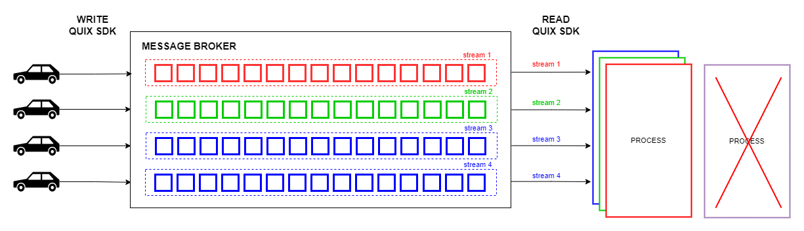
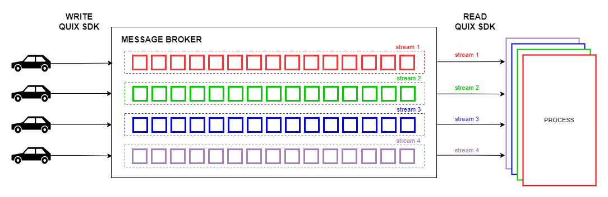

# Horizontal scaling

The Quix SDK provides horizontal scaling with the [streaming context](/sdk/features/streaming-context). This means a data scientist or data engineer does not have to implement parallel processing themselves.

Imagine the following example:


Each car produces one stream with its own time-series data, and each stream is processed by each replica of the deployment, labelled "Process". By default the message broker will assign each stream to one replica via the [RangeAssignor strategy](https://kafka.apache.org/23/javadoc/org/apache/kafka/clients/consumer/RangeAssignor.html).

Now, one of the replicas crashes (the purple one), and the "stream 4" is assigned automatically to the blue replica.



This situation will trigger an event on the SDK in the blue replica indicating that "stream 4" has been received:

=== "Python"
    
    ``` python
    def read_stream(input_topic: InputTopic, new_stream: StreamReader):
        print("New stream received:" + new_stream.stream_id)
    
    input_topic.on_stream_received = read_stream
    ```

=== "C\#"
    
    ``` cs
    inputTopic.OnStreamReceived += (topic, newStream) =>
    {
        Console.WriteLine($"New stream received: {newStream.StreamId}");
    };
    ```

output on blue replica:

``` console
New stream received: stream 4
```

When the purple replica has restarted and becomes available again, it takes back control of "stream 4".



This will trigger two events, one in the blue replica indicating that "stream 4" has been revoked, and one in the purple replica indicating that "stream 4" has been assigned again:

=== "Python"
    
    ``` python
    def read_stream(input_topic: InputTopic, new_stream: StreamReader):
        print("New stream received:" + new_stream.stream_id)
    
    def streams_revoked(input_topic: InputTopic, streams_revoked: [StreamReader]):
        for stream in streams_revoked:
            print("Stream revoked:" + stream.stream_id)
    
    input_topic.on_stream_received = read_stream
    input_topic.on_streams_revoked = streams_revoked
    ```

=== "C\#"
    
    ``` cs
    inputTopic.OnStreamReceived += (topic, newStream) =>
    {
        Console.WriteLine($"New stream received: {newStream.StreamId}");
    };
    
    inputTopic.OnStreamsRevoked += (topic, streamsRevoked) =>
    {
        foreach (var stream in streamsRevoked)
        {
            Console.WriteLine($"Stream revoked: {stream.StreamId}");
        }
    };
    ```

Output on the blue replica:

``` console
Stream revoked: stream 4
```

Output on the purple replica:

``` console
New stream received: stream 4
```

The same behaviour will happen if we scale the "Process" deployment up or down, increasing or decreasing the number of replicas. Kafka will trigger the rebalancing mechanism internally and this will trigger the same events on the Quix SDK.

## Rebalancing mechanism and Partitions

Kafka uses partitions and the [RangeAssignor strategy](https://kafka.apache.org/23/javadoc/org/apache/kafka/clients/consumer/RangeAssignor.html) to decide which consumers receive which messages. 

Partitions and the Kafka rebalancing protocol are internal details of the Kafka implementation behind the Quix SDK. You don’t need to worry about them because everything is abstracted within the [Streaming Context](/sdk/features/streaming-context) feature of the SDK. The events described above will remain the same, even if the SDK uses another Message Broker technology or another rebalancing mechanism in the future.

!!! warning

    Because of how the Kafka rebalancing mechanism works, you should follow one golden rule: you cannot have more replicas than the number of partitions the input Topic has.
