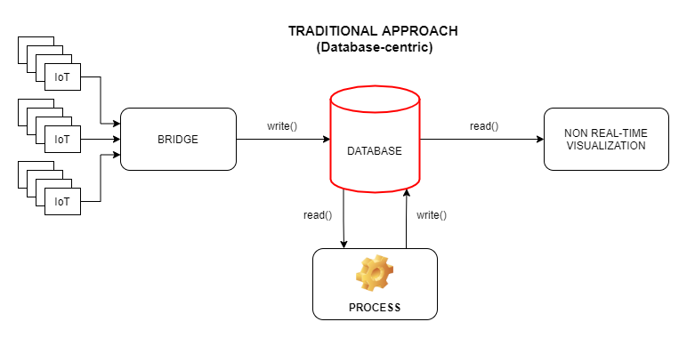
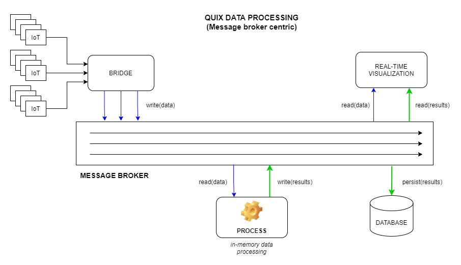

# In-memory processing

Traditional architectures for applications that need to process data have always been very database-centric. This means that, when you needed to process data and get some value out of it, everything had to pass through a database several times. This approach worked when the amount of data to process was relatively low, and the latency needed was on the scale of "days". But with a world changing to more real-time use cases where you need results on the scale of seconds or nanoseconds, and where you can get millions of IoT devices sending data to process at the same time, traditional database-centric architectures don't scale.

The Quix SDK uses a message broker and it puts it at the very center of the application, enabling a new approach for [processing data](/sdk/process) without the need to save and pass all the information through a database. By using [in-memory processing](#in-memory-processing), you can persist only the data you’re really interested in keeping.

This approach lowers the complexity and cost of real-time data processing by several orders of magnitude and, in fact, it is the only possible approach when you need to process a huge amount of data per second with low latency requirements.

The SDK offers you a very simple way of processing time-series data in real-time. Refer to the [Processing data](/sdk/process) section of this documentation for further details.
