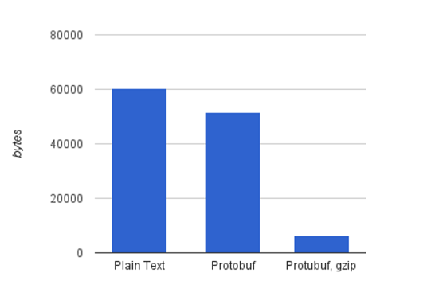

# Message compression

The Quix SDK uses efficient ParameterData transport objects to transmit
messages through the message broker, reducing them by an average factor
of 10 times compared with plain JSON conversion.

On top of that, we apply codecs like Protobuf and Gzip compression to
achieve the best performance possible with the minimum payload.

All these improvements are completely transparent and you don’t even
need to worry about them because everything happens behind the scenes.
