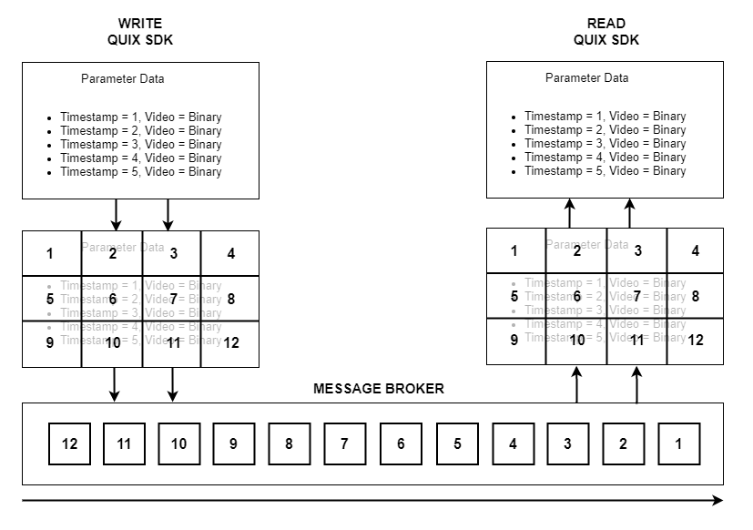

# Message splitting

Message brokers have a message size limitation by design to ensure performance. For example, Kafka has a 1MB limit by default, and while you can increase it, it will have performance implications, and has a suggested upper limit of 10 MB. This can be a problem in some use cases where messages published are large, such as sound and video binary chunks, or large volumes of time-series data.

Quix Streams automatically handles large messages on the producer side, splitting them up if required and merging them back together at the consumer side, in a totally transparent way.

This feature gives you 255 times the broker message size limit, independent of the message broker used. This can be useful for a use case where you get messages that occasionally exceed the limit of your broker, as this will not generate exceptions.

!!! warning

    While this feature is useful, effort should be made to stay within your broker's limit, to avoid complex commit limitations and increased memory footprint in the consumer. If you consistently have large messages that exceed the broker limit, you should consider uploading the messages to an external storage system, and only send a reference to the message through the broker.
