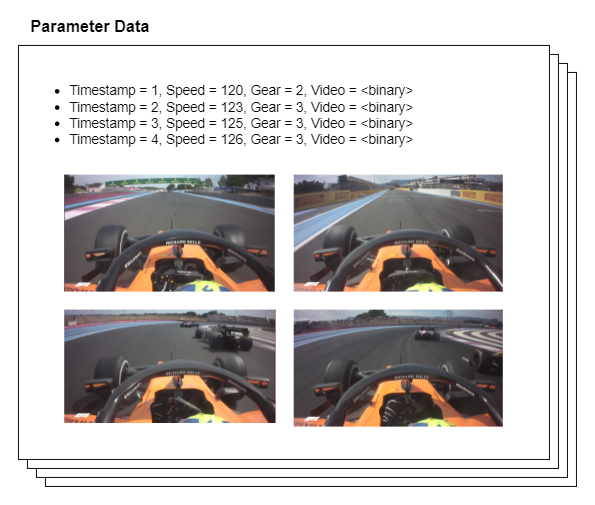

# Multiple data types

The Quix SDK lets you attach any type of data — Numbers, Strings, or raw
Binary data — to your timestamps.

For example, with Quix you can send telemetry data from your vehicle or
IoT device and attach a picture or video frame to the same timestamp.

This gives the SDK the ability to adapt to any streaming application use
case, from plain telemetry data to video streaming, or a mix of both.
