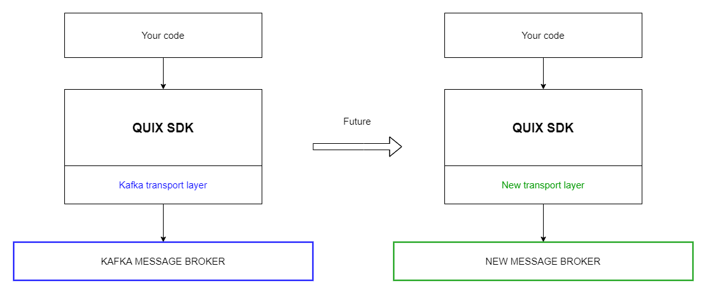

# Portability

The Quix SDK works as an abstraction layer on top of a concrete broker
technology like Kafka.

The SDK sits on top of a Kafka layer and solves all the common problems
you might face when processing time-series data using the Kafka
technology. However, in future, we can use different message broker
technologies without changing the common SDK interface.

Using the Quix SDK, you’re not locked into a specific broker technology.
You can innovate over time and change the underlying technologies
without changing a single line of code of your solution.
