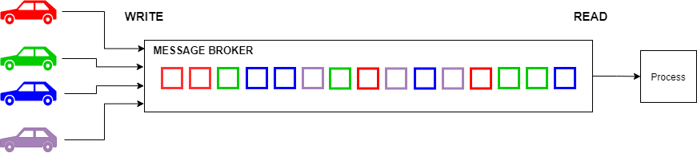
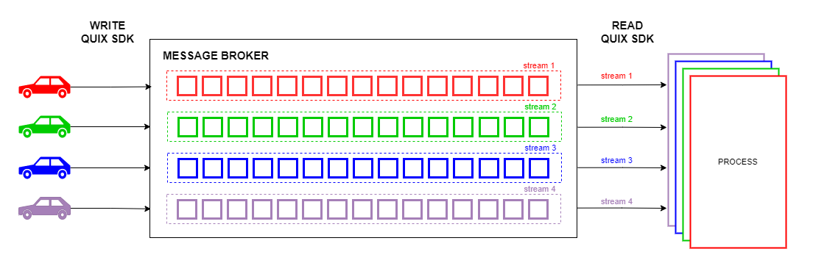
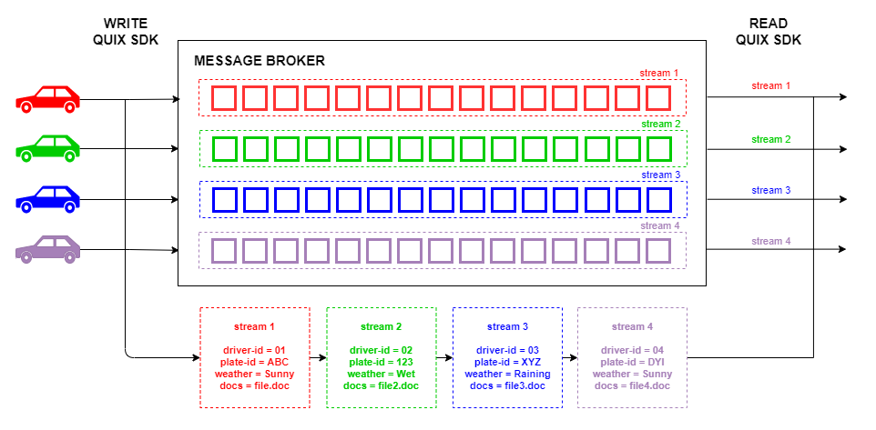

# Streaming context

Broker client libraries allow you to send messages that can contain anything, using binary content. This is what they're designed for and Quix Streams is built on such library also. The problem with these messages is that by default they don't have any relation to each other and we found that is something streaming frequently needs.

Sending messages using a broker client library would look like this:

Quix Streams creates a stream context for you to group all data for a source. Among other things, this enables [automatic horizontal scaling](horizontal-scaling.md) of your models when you deal with multiple data sources.

This context simplifies processing streams by providing callbacks on the subscribing side. You can keep working with each context (stream) separately or together, depending on your needs.

The library also allows you to [attach metadata](../subscribe.md) to streams, like ids, location, references, time or any other type of information related to the data source.

This metadata can be read by the library real time or browsed in our SaaS, if you choose to persist the topic streams.
