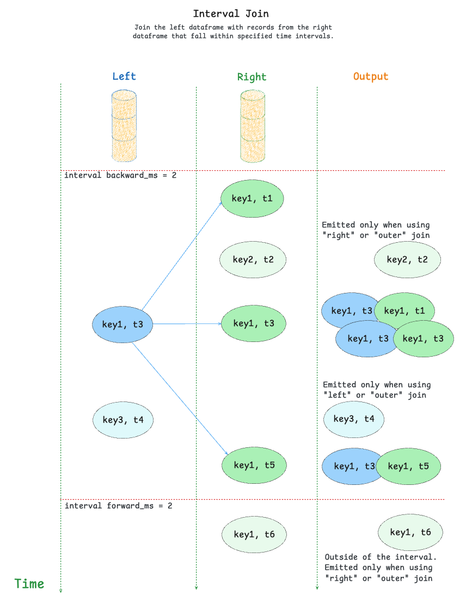

# Joins
## Join as-of
> _New in [3.15.0](https://github.com/quixio/quix-streams/releases/tag/v3.15.0)_

Use `StreamingDataFrame.join_asof()` to join two topics into a new stream where each left record 
is merged with the right record with the same key whose timestamp is less than or equal to the left timestamp.

This join is built with the timeseries enrichment use cases in mind, where the left side represents some measurements and the right side represents events.

Some examples:

- Matching of the sensor measurements with the events in the system.  
- Joining the purchases with the effective prices of the goods.

During as-of join, the records on the right side get stored into a lookup table in the state, and the records from the left side query this state for matches. 


### Requirements
To perform a join, the underlying topics must follow these requirements:

1. **Both topics must have the same number of partitions.**   
Join is a stateful operation, and it requires partitions of left and right topics to be assigned to the same application during processing.

2. **Keys in both topics must be distributed across partitions using the same algorithm.**
For example, messages with the key `A` must go to the same partition number for both left and right topics. This is Kafka's default behaviour.  


### Example

Join records from the topic "measurements" with the latest effective records from 
the topic "metadata" using the "inner" join strategy and a grace period of 14 days:

```python
from datetime import timedelta

from quixstreams import Application

app = Application(...)

sdf_measurements = app.dataframe(app.topic("measurements"))
sdf_metadata = app.dataframe(app.topic("metadata"))

# Join records from the topic "measurements"
# with the latest effective records from the topic "metadata".
# using the "inner" join strategy and keeping the "metadata" records stored for 14 days in event time.
sdf_joined = sdf_measurements.join_asof(
    right=sdf_metadata,
    how="inner",                 # Emit updates only if the match is found in the store.
    on_merge="keep-left",        # Prefer the columns from the left dataframe if they overlap with the right. 
    grace_ms=timedelta(days=14), # Keep the state for 14 days (measured in event time similar to windows).
)

if __name__ == '__main__':
    app.run()
```


### How it works

Here is a description of the as-of join algorithm:

- Records from the right side get written to the state store without emitting any updates downstream.
- Records on the left side query the right store for the values with the same **key** and the timestamp lower or equal to the record's timestamp.
- If the match is found, the two records are merged together into a new one according to the `on_merge` logic.
- The size of the right store is controlled by the "grace_ms":
  a newly added "right" record expires other values with the same key with timestamps below "<current timestamp> - <grace_ms>".

#### Joining strategies
As-of join supports the following joining strategies:

- `inner` - emit the output for the left record only when the match is found (default)
- `left` - emit the result for each left record even without matches on the right side

#### Merging records together
When the match is found, the two records are merged according to the `on_merge` parameter.  

Out-of-the-box implementations assume that records are **dictionaries**.  
For merging other data types (as well as customizing the behavior) use the callback option.

Possible values:

- `raise` - merge two records together into a new dictionary and raise an exception if the same keys are found in both dictionaries.  
This is a default behavior.

- `keep-left` - merge two records together into a new dictionary and prefer keys from the **left** record in case of overlap.

- `keep-right` - merge two records together into a new dictionary and prefer keys from the **right** record in case of overlap.

- custom callback - pass a callback `(<left>, <right>) -> <merged>` to merge the records manually.  
Use it when non-dictionary types are expected, or you want to customize the returned object:

```python
from typing import Optional

from quixstreams import Application

app = Application(...)

sdf_measurements = app.dataframe(app.topic("measurements"))
sdf_metadata = app.dataframe(app.topic("metadata"))


def on_merge(left: int, right: Optional[str]) -> dict:
    """
    Merge non-dictionary items into a dict
    """
    return {'measurement': left, 'metadata': right}


sdf_joined = sdf_measurements.join_asof(right=sdf_metadata, on_merge=on_merge)

if __name__ == '__main__':
    app.run()
```


#### State expiration
`StreamingDataFrame.join_asof` stores the right records to the state.  
The `grace_ms` parameter regulates the state's lifetime (default - 7 days) to prevent it from growing in size forever.

It shares some similarities with `grace_ms` in [Windows](windowing.md/#lateness-and-out-of-order-processing):

- The timestamps are obtained from the records. 
- The join key keeps track of the maximum observed timestamp for **each individual key**.
- The older values get expired only when the larger timestamp gets stored to the state.

Adjust `grace_ms` based on the expected time gap between the left and the right side of the join.

### Limitations

- Joining dataframes belonging to the same topics (aka "self-join") is not supported.
- Join types "right" and "outer" are not supported.
- As-of join preserves headers only for the left dataframe. If you need headers of the right side records, consider adding them to the value.

### Message ordering between partitions
Streaming joins use [`StreamingDataFrame.concat()`](concatenating.md) under the hood, which means that the application's internal consumer goes into a special "buffered" mode
when the join is used.

In this mode, it buffers messages per partition in order to process them in the timestamp order between different topics.  
Timestamp alignment is effective only for the partitions **with the same numbers**: partition zero is aligned with other zero partitions, but not with partition one.

Note that message ordering works only when the messages are consumed from the topics.  
If you change timestamps of the record during processing, they will be processed in the original order.

## Lookup join

> _New in [3.16.0](https://github.com/quixio/quix-streams/releases/tag/v3.16.0)_

!!! warning
    This is an experimental feature; the API may change in future releases.

`StreamingDataFrame.join_lookup()` is a special type of join that allows you to enrich records in a streaming dataframe with data from external systems. This is particularly useful for enriching streaming data with configuration or reference data from external sources like databases, configuration services, or APIs.

### Key Concepts

Lookup joins work by:

1. **Lookup Strategy**: A subclass of `BaseLookup` that defines how to query external sources and cache results
2. **Field Definitions**: Subclasses of `BaseField` that specify how to extract and map enrichment data
3. **In-place Enrichment**: Records are updated directly with the enrichment data

### Basic Example with SQLite

Here's a simple example using SQLite for reference data:

```python
from quixstreams import Application
from quixstreams.dataframe.joins.lookups import SQLiteLookup, SQLiteLookupField

app = Application(...)

# Create a lookup instance for SQLite database
lookup = SQLiteLookup(path="reference_data.db")

sdf = app.dataframe(app.topic("sensor-data"))

# Enrich sensor data with reference information
sdf = sdf.join_lookup(
    lookup,
    on="device_id",  # Column to match on
    fields={
        "device_info": SQLiteLookupField(
            table="devices", 
            columns=["name", "model", "location"], 
            on="device_id"
        ),
        "calibration": SQLiteLookupField(
            table="calibrations",
            columns=["offset", "scale", "last_calibrated"],
            on="device_id"
        )
    },
)

if __name__ == '__main__':
    app.run()
```

### Dynamic Configuration Integration

For real-time configuration management, use the Quix Configuration Service integration:

```python
from quixstreams import Application
from quixstreams.dataframe.joins.lookups import QuixConfigurationService

app = Application()

# Create a lookup instance pointing to your configuration topic
lookup = QuixConfigurationService(
    topic=app.topic("device-configurations"),
    app_config=app.config
)

sdf = app.dataframe(app.topic("sensor-data"))

# Enrich with dynamic configuration data
sdf = sdf.join_lookup(
    lookup=lookup,
    on="device_id",
    fields={
        "device_config": lookup.json_field(
            jsonpath="$.device",
            type="device-config"
        ),
        "calibration_params": lookup.json_field(
            jsonpath="$.calibration",
            type="device-config"
        ),
        "firmware_version": lookup.json_field(
            jsonpath="$.firmware.version",
            type="device-config"
        )
    }
)

if __name__ == '__main__':
    app.run()
```

### Advanced Configuration Matching

Use custom key matching logic for complex scenarios:

```python
def custom_key_matcher(value, key):
    """Custom logic to determine configuration key"""
    device_type = value.get("device_type", "unknown")
    location = value.get("location", "default")
    return f"{device_type}-{location}"


# Use custom key matching
sdf = sdf.join_lookup(
    lookup=lookup,
    on=custom_key_matcher,
    fields={
        "location_config": lookup.json_field(
            jsonpath="$",
            type="location-config"
        )
    }
)
```

### Binary Data Support

For non-JSON configurations (firmware files, calibration data, etc.):

```python
sdf = sdf.join_lookup(
    lookup=lookup,
    on="device_id",
    fields={
        "firmware_binary": lookup.bytes_field(
            type="firmware"
        ),
        "calibration_data": lookup.bytes_field(
            type="calibration"
        )
    }
)
```

### How Lookup Joins Work

1. **Record Processing**: For each record in the dataframe, the lookup strategy is called with the matching key and field definitions
2. **External Query**: The lookup strategy queries the external source (database, API, configuration service) based on the key
3. **Data Extraction**: Field definitions specify how to extract and map the enrichment data from the external source
4. **In-place Update**: The record is updated directly with the enrichment data
5. **Caching**: Results are cached locally to minimize external calls and improve performance

### Performance Considerations

- **Caching**: Lookup results are cached to minimize external API calls
- **Batch Processing**: Consider batching multiple lookups for better performance
- **Error Handling**: Implement proper fallback behavior for missing data
- **Memory Usage**: Be mindful of cache size for large datasets

### Use Cases

- **Configuration Enrichment**: Enrich streaming data with device configurations, calibration parameters, or system settings
- **Reference Data**: Join with lookup tables for device information, user profiles, or product catalogs
- **Real-time Updates**: Use with Dynamic Configuration for real-time configuration updates
- **Data Validation**: Enrich with validation rules or business logic
- **Multi-source Enrichment**: Combine data from multiple external sources

### Integration with Quix Cloud

For production use cases, consider using the [Quix Dynamic Configuration service](https://quix.io/docs/quix-cloud/managed-services/dynamic-configuration.html) which provides:

- **Real-time Configuration Updates**: Lightweight Kafka events for configuration changes
- **Version Management**: Automatic versioning and timestamp-based lookups
- **Large File Support**: Handle configuration files too large for direct Kafka streaming
- **Binary Data Support**: Support for both JSON and binary configuration content
- **High Performance**: Optimized for high-throughput streaming applications

👉 See the [Dynamic Configuration documentation](https://quix.io/docs/quix-cloud/managed-services/dynamic-configuration.html) for complete setup and usage details.

## Interval join

> _New in [3.17.0](https://github.com/quixio/quix-streams/releases/tag/v3.17.0)_

Use `StreamingDataFrame.join_interval()` to join two topics into a new stream where each record is merged with records from the other topic that fall within a specified time interval.

This join is useful for cases where you need to match records that occur within a specific time window of each other, rather than just the latest record (as in as-of join).



### Example

Join records from the topic "measurements" with records from the topic "events" that occur within a 5-minute window before and after each measurement:

```python
from datetime import timedelta

from quixstreams import Application

app = Application(...)

sdf_measurements = app.dataframe(app.topic("measurements"))
sdf_events = app.dataframe(app.topic("events"))

# Join records from the topic "measurements"
# with records from "events" that occur within a 5-minute window
# before and after each measurement
sdf_joined = sdf_measurements.join_interval(
    right=sdf_events,
    how="inner",                 # Emit updates only if matches are found
    on_merge="keep-left",        # Prefer the columns from the left dataframe if they overlap
    grace_ms=timedelta(days=7),  # Keep the state for 7 days
    backward_ms=timedelta(minutes=5),  # Look for events up to 5 minutes before
    forward_ms=timedelta(minutes=5),   # Look for events up to 5 minutes after
)

if __name__ == '__main__':
    app.run()
```

### How it works

The interval join algorithm works as follows:

- Records from both sides are stored in the state store
- For each record on the left side:
  - Look for matching records on the right side that fall within the specified time interval
  - If matches are found, merge the records according to the `on_merge` logic
  - For inner joins, only emit if matches are found
  - For left joins, emit even without matches
- For each record on the right side:
  - Look for matching records on the left side that fall within the specified time interval
  - Merge all matching records according to the `on_merge` logic

#### Time intervals
The join uses two time intervals to determine matches:

- `backward_ms`: How far back in time to look for matches from the right side
- `forward_ms`: How far forward in time to look for matches from the right side

> **Note:** When both `backward_ms` and `forward_ms` are set to 0 (default), the join will only match records with exactly the same timestamp.

The `grace_ms` parameter controls how long records are kept in the state store, similar to other join types.

#### Joining strategies
Interval join supports the following joining strategies:

- `inner` - emit the output for the left record only when the match is found (default)
- `left` - emit the result for each left record even without matches on the right side
- `right` - emit the result for each right record even without matches on the left side
- `outer` - emit the output for both left and right records even without matches

#### Merging records
The merging behavior is controlled by the `on_merge` parameter, which works the same way as in other join types:

- `raise` - merge records and raise an exception if keys overlap (default)
- `keep-left` - prefer keys from the left record in case of overlap
- `keep-right` - prefer keys from the right record in case of overlap
- custom callback - use a custom function to merge records

> **Warning:** Custom merge functions must not mutate the input values as this will lead to
> unexpected exceptions or incorrect data in the joined stream. Always return a new object instead.

### Limitations

- Joining dataframes belonging to the same topic (aka "self-join") is not supported.
- The `backward_ms` must not be greater than the `grace_ms` to avoid losing data.
- Interval join does not preserve any headers. If you need headers from any side, consider adding them to the value.
- The performance of the interval join depends on the density of the data.   
If both streams have too many matching messages falling within the interval, the performance may drop significantly due to the large number of produced outputs.
