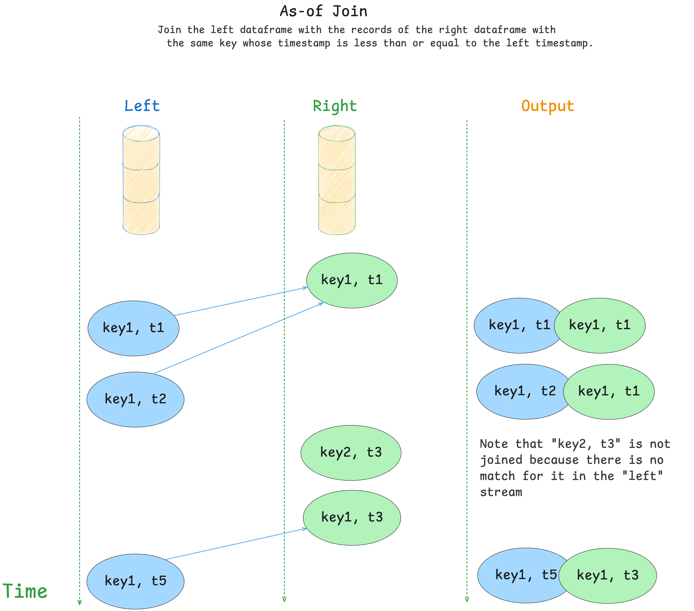

# Joins
## Join as-of


Use `StreamingDataFrame.join_asof()` to join two topics into a new stream where each left record 
is merged with the right record with the same key whose timestamp is less than or equal to the left timestamp.

This join is built with the timeseries enrichment use cases in mind, where the left side represents some measurements and the right side represents events.

Some examples:

- Matching of the sensor measurements with the events in the system.  
- Joining the purchases with the effective prices of the goods.

During as-of join, the records on the right side get stored into a lookup table in the state, and the records from the left side query this state for matches. 



### Requirements
To perform a join, the underlying topics must follow these requirements:

1. **Both topics must have the same number of partitions.**   
Join is a stateful operation, and it requires partitions of left and right topics to be assigned to the same application during processing.

2. **Keys in both topics must be distributed across partitions using the same algorithm.**
For example, messages with the key `A` must go to the same partion number for both left and right topics.  


### Example

Join records from the topic "measurements" with the latest effective records from 
the topic "metadata" using the "inner" join strategy and a grace period of 14 days:

```python
from datetime import timedelta

from quixstreams import Application

app = Application(...)

sdf_measurements = app.dataframe(app.topic("measurements"))
sdf_metadata = app.dataframe(app.topic("metadata"))

# Join records from the topic "measurements"
# with the latest effective records from the topic "metadata".
# using the "inner" join strategy and keeping the "metadata" records stored for 14 days in event time.
sdf_joined = sdf_measurements.join_asof(
    right=sdf_metadata,
    how="inner",                 # Emit updates only if the match is found in the store.
    on_merge="keep-left",        # Prefer the columns from the left dataframe if they overlap with the right. 
    grace_ms=timedelta(days=14), # Keep the state for 14 days (measured in event time similar to windows).
)

if __name__ == '__main__':
    app.run()
```


### How it works

Here is a description of the as-of join algorithm:

- Records from the right side get written to the state store without emitting any updates downstream.
- Records on the left side query the right store for the values with the same **key** and the timestamp lower or equal to the record's timestamp.
  Left side emits data downstream.
- If the match is found, the two records are merged together into a new one according to the `on_merge` logic.
- The size of the right store is controlled by the "grace_ms":
  a newly added "right" record expires other values with the same key with timestamps below "<current timestamp> - <grace_ms>".

#### Joining strategies
As-of join supports the following joining strategies:

- `inner` - emit the output for the left record only when the match is found (default).
- `left` - emit the output for the left record even without a match.


#### Merging records together
When the match is found, the two records are merged according to the `on_merge` parameter.  

Out-of-box implementations assume that records are **dictionaries**.  
For merging other data types (as well as customizing the behavior) use the callback option.

Possible values:

- `raise` - merge two records together into a new dictionary and raise an exception if the same keys are found in both dictionaries.  
This is a default behavior.

- `keep-left` - merge two records together into a new dictionary and prefer keys from the **left** record in case of overlap.

- `keep-right` - merge two records together into a new dictionary and prefer keys from the **right** record in case of overlap.

- custom callback - pass a callback `(<left>, <right>) -> <merged>` to merge the records manually.  
Use it when non-dictionary types are expected, or you want to customize the returned object.

#### State expiration
`StreamingDataFrame.join_asof` stores the right records to the state.  
The `grace_ms` parameter regulates the state's lifetime (default - 7 days) to prevent it from growing in size forever.

It shares some similarities with `grace_ms` in [Windows](windowing.md/#lateness-and-out-of-order-processing):

- The timestamps are obtained from the records. 
- The join key keeps track of the maximum observed timestamp for **each individual key**.
- The older values get expired only when the larger timestamp gets stored to the state.

Adjust `grace_ms` based on the expected time gap between the left and the right side of the join.

### Limitations

- Joining dataframes belonging to the same topics (aka "self-join") is not supported.
- As-of join preserves headers only for the left dataframe.  
If you need headers of the right side records, consider adding them to the value.

## Message ordering between partitions
Joins use [`StreamingDataFrame.concat()`](concatenating.md) under the hood, which means that the application's internal consumer goes into a special "buffered" mode
when the join is used.

In this mode, it buffers messages per partition in order to process them in the timestamp order between different topics.  
Timestamp alignment is effective only for the partitions **with the same numbers**: partition zero is aligned with other zero partitions, but not with partition one.

Note that message ordering works only when the messages are consumed from the topics.  
If you change timestamps of the record during processing, they will be processed in the original order.


