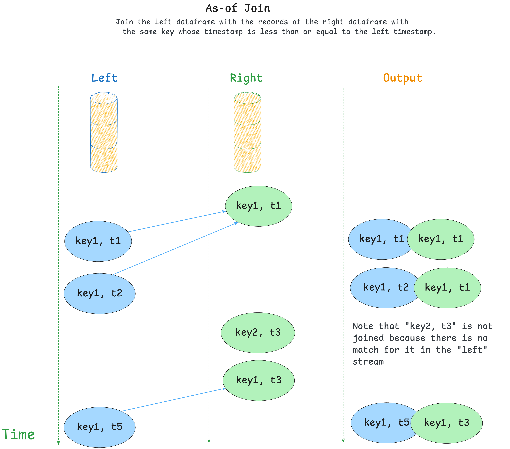
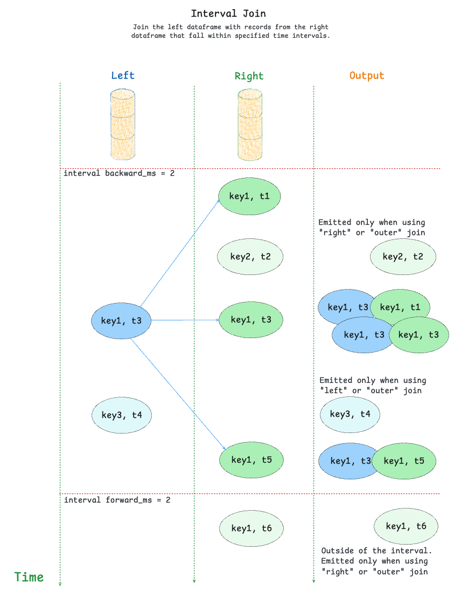

# Joins
## Join as-of
> _New in [3.15.0](https://github.com/quixio/quix-streams/releases/tag/v3.15.0)_

Use `StreamingDataFrame.join_asof()` to join two topics into a new stream where each left record
is merged with the most recent right record that shares the same message key and has a timestamp less than or equal to the left record's timestamp.

This join is built with the timeseries enrichment use cases in mind, where the left side represents some measurements and the right side represents events.

Some examples:

- Matching of the sensor measurements with the events in the system.  
- Joining the purchases with the effective prices of the goods.

During as-of join, the records on the right side get stored into a lookup table in the state, and the records from the left side query this state for matches. 



### Requirements
To perform a join, the underlying topics must follow these requirements:

1. **Both topics must have the same number of partitions.**   
Join is a stateful operation, and it requires partitions of left and right topics to be assigned to the same application during processing.

2. **Keys in both topics must be distributed across partitions using the same algorithm.**
For example, messages with the key `A` must go to the same partition number for both left and right topics. This is Kafka's default behaviour.

> **How co-assignment works under the hood:**
> Quix Streams forces the Kafka consumer `partition.assignment.strategy` to `range`.
> This guarantees that each consumer in the group receives the same partition number across all subscribed topics — e.g. the consumer that gets partition 0 from topic A will also get partition 0 from topic B.
> Combined with the equal partition count requirement, this ensures join data always lands on the same consumer instance.


### Example

Join records from the topic "measurements" with the latest effective records from 
the topic "metadata" using the "inner" join strategy and a grace period of 14 days:

```python
from datetime import timedelta

from quixstreams import Application

app = Application(...)

sdf_measurements = app.dataframe(app.topic("measurements"))
sdf_metadata = app.dataframe(app.topic("metadata"))

# Join records from the topic "measurements"
# with the latest effective records from the topic "metadata".
# using the "inner" join strategy and keeping the "metadata" records stored for 14 days in event time.
sdf_joined = sdf_measurements.join_asof(
    right=sdf_metadata,
    how="inner",                 # Emit updates only if the match is found in the store.
    on_merge="keep-left",        # Prefer the columns from the left dataframe if they overlap with the right. 
    grace_ms=timedelta(days=14), # Keep the state for 14 days (measured in event time similar to windows).
)

if __name__ == '__main__':
    app.run()
```


### How it works

Here is a description of the as-of join algorithm:

- Records from the right side get written to the state store without emitting any updates downstream.
- Records on the left side query the right store for the values with the same **key** and the timestamp lower or equal to the record's timestamp.
- If the match is found, the two records are merged together into a new one according to the `on_merge` logic.
- The size of the right store is controlled by `grace_ms`:
  when a new right record is stored, any older right records for the same key whose timestamps are more than `grace_ms` behind the new record's timestamp are expired and removed.

#### Joining strategies
As-of join supports the following joining strategies:

- `inner` - emit the output for the left record only when the match is found (default)
- `left` - emit the result for each left record even without matches on the right side

#### Merging records together
When the match is found, the two records are merged according to the `on_merge` parameter.  

Out-of-the-box implementations assume that records are **dictionaries**.  
For merging other data types (as well as customizing the behavior) use the callback option.

Possible values:

- `raise` - merge two records together into a new dictionary and raise an exception if the same keys are found in both dictionaries.  
This is a default behavior.

- `keep-left` - merge two records together into a new dictionary and prefer keys from the **left** record in case of overlap.

- `keep-right` - merge two records together into a new dictionary and prefer keys from the **right** record in case of overlap.

- custom callback - pass a callback `(<left>, <right>) -> <merged>` to merge the records manually.  
Use it when non-dictionary types are expected, or you want to customize the returned object:

```python
from typing import Optional

from quixstreams import Application

app = Application(...)

sdf_measurements = app.dataframe(app.topic("measurements"))
sdf_metadata = app.dataframe(app.topic("metadata"))


def on_merge(left: int, right: Optional[str]) -> dict:
    """
    Merge non-dictionary items into a dict
    """
    return {'measurement': left, 'metadata': right}


sdf_joined = sdf_measurements.join_asof(right=sdf_metadata, on_merge=on_merge)

if __name__ == '__main__':
    app.run()
```


#### State expiration
`StreamingDataFrame.join_asof` stores the right records to the state.  
The `grace_ms` parameter regulates the state's lifetime (default - 7 days) to prevent it from growing in size forever.

It shares some similarities with `grace_ms` in [Windows](windowing.md/#lateness-and-out-of-order-processing):

- The timestamps are obtained from the records. 
- The join key keeps track of the maximum observed timestamp for **each individual key**.
- The older values get expired only when the larger timestamp gets stored to the state.

Adjust `grace_ms` based on the expected time gap between the left and the right side of the join.

### Limitations

- Joining dataframes belonging to the same topics (aka "self-join") is not supported.
- Join types "right" and "outer" are not supported.
- As-of join preserves headers only for the left dataframe. If you need headers of the right side records, consider adding them to the value.

### Message ordering between partitions
Streaming joins use [`StreamingDataFrame.concat()`](concatenating.md) under the hood, which means that the application's internal consumer goes into a special "buffered" mode
when the join is used.

In this mode, it buffers messages per partition in order to process them in the timestamp order between different topics.  
Timestamp alignment is effective only for the partitions **with the same numbers**: partition zero is aligned with other zero partitions, but not with partition one.

Note that message ordering works only when the messages are consumed from the topics.  
If you change timestamps of the record during processing, they will be processed in the original order.

## Lookup join

> _New in [3.16.0](https://github.com/quixio/quix-streams/releases/tag/v3.16.0)_

!!! warning
    This is an experimental feature; the API may change in future releases.

`StreamingDataFrame.join_lookup()` is a special type of join that allows you to enrich records in a streaming dataframe with data from external systems. This is particularly useful for enriching streaming data with configuration or reference data from external sources like databases, configuration services, or APIs.

### Key Concepts

Lookup joins work by:

1. **Lookup Strategy**: A subclass of `BaseLookup` that defines how to query external sources and cache results
2. **Field Definitions**: Subclasses of `BaseField` that specify how to extract and map enrichment data
3. **In-place Enrichment**: Records are updated directly with the enrichment data

### Basic Example with SQLite

Here's a simple example using SQLite for reference data:

```python
from quixstreams import Application
from quixstreams.dataframe.joins.lookups import SQLiteLookup, SQLiteLookupField

app = Application(...)

# Create a lookup instance for SQLite database
lookup = SQLiteLookup(path="reference_data.db")

sdf = app.dataframe(app.topic("sensor-data"))

# Enrich sensor data with reference information
sdf = sdf.join_lookup(
    lookup,
    on="device_id",  # Column to match on
    fields={
        "device_info": SQLiteLookupField(
            table="devices", 
            columns=["name", "model", "location"], 
            on="device_id"
        ),
        "calibration": SQLiteLookupField(
            table="calibrations",
            columns=["offset", "scale", "last_calibrated"],
            on="device_id"
        )
    },
)

if __name__ == '__main__':
    app.run()
```

### Dynamic Configuration Integration

For real-time configuration management, use the Quix Configuration Service integration:

```python
from quixstreams import Application
from quixstreams.dataframe.joins.lookups import QuixConfigurationService

app = Application()

# Create a lookup instance pointing to your configuration topic
lookup = QuixConfigurationService(
    topic=app.topic("device-configurations"),
    app_config=app.config
)

sdf = app.dataframe(app.topic("sensor-data"))

# Enrich with dynamic configuration data
sdf = sdf.join_lookup(
    lookup=lookup,
    on="device_id",
    fields={
        "device_config": lookup.json_field(
            jsonpath="$.device",
            type="device-config"
        ),
        "calibration_params": lookup.json_field(
            jsonpath="$.calibration",
            type="device-config"
        ),
        "firmware_version": lookup.json_field(
            jsonpath="$.firmware.version",
            type="device-config"
        )
    }
)

if __name__ == '__main__':
    app.run()
```

### Late-arriving configuration (`LookupBuffer`)

By default, `join_lookup()` is non-blocking and never waits: if the matching configuration has not arrived when a record does, the join resolves every field to its declared `default=` immediately and the record moves on. That is safe and costs nothing, but it means a record that arrived one second before its configuration is enriched with defaults forever.

A `LookupBuffer` changes that without ever sleeping. A record whose lookup cannot be resolved is **withheld**: it is written to a durable state store and nothing is emitted for it. When a later record for the same key resolves — because the configuration has since landed — the withheld records are read back, enriched, and emitted ahead of it, each **with its own timestamp, key and headers**. A record that waits longer than `grace_ms` meets the fate you chose with `on_timeout`.

Nothing blocks. Other keys and other partitions keep processing at full rate while a key waits.

```python
from datetime import timedelta

from quixstreams import Application
from quixstreams.dataframe.joins.lookups import LookupBuffer, QuixConfigurationService

app = Application()
sdf = app.dataframe(app.topic("sensor-data"))

lookup = QuixConfigurationService(
    topic=app.topic("device-configurations"),
    app_config=app.config,
    # Writes the list of configuration types that did not resolve onto each
    # record, so `is_resolved` below has something to read.
    unresolved_types_field="__unresolved__",
)

fields = {
    "threshold": lookup.json_field("$.threshold", type="device", default=None),
    "region": lookup.json_field("$.region", type="device", default="unknown"),
}

sdf = sdf.join_lookup(
    lookup,
    fields,
    on="device_id",
    buffer=LookupBuffer(
        grace_ms=timedelta(seconds=30),
        is_resolved=lambda value: not value["__unresolved__"],
    ),
)

if __name__ == '__main__':
    app.run()
```

**Parameter reference:**

| Parameter | Type | Default | Description |
|---|---|---|---|
| `grace_ms` | `int` (milliseconds) or `timedelta` | required | How long a record may wait for its configuration, in **wall-clock real time**. |
| `is_resolved` | `Callable[[dict], bool]` | required | Predicate deciding whether a record's lookup succeeded, called with the value after the join. |
| `on_timeout` | `"emit"` or `"drop"` | `"emit"` | What happens to a record that runs out of grace. |
| `max_buffered_per_key` | `int` | `10_000` | Safety valve against a pathological rate of unresolvable records for one key. A record arriving at a full key is dropped. |
| `store_name` | `str` | `"lookup-buffer"` | Name of the state store holding the buffer. |

#### It makes your application stateful

The buffer is a changelog-backed state store, and that is not optional. A record's Kafka offset is committed because the record was *consumed*, not because it was *emitted*, and there is no way to withhold an offset for a record still in flight. An in-memory buffer would therefore lose every withheld record on a rebalance or restart — silently, with the offsets already committed. In the state store, the buffer writes land in the same checkpoint transaction as the offset commit, so state and consumed offsets advance together and the new owner recovers the buffer from the changelog.

The practical consequences:

- The service needs a state directory, and on Quix Cloud it needs `state: {enabled: true}` in `quix.yaml`. A misconfigured deployment fails loudly at startup.
- The buffer is written to a changelog topic. At a high rate of unresolvable records this can exceed the input topic's own volume — see sizing below.

#### `on_timeout`: what happens when the grace runs out

`"emit"` (the default) sends the record downstream carrying each field's declared `default=`. This is **exactly** what an unbuffered `join_lookup` would have produced for the same record immediately: there is one implementation of "no configuration", and only the timing differs. Spell nulls as `default=None` on the field:

```python
fields = {
    "threshold": lookup.json_field("$.threshold", type="device", default=None),      # null
    "region":    lookup.json_field("$.region",    type="device", default="unknown"),
}
```

`"drop"` discards the record permanently, with a rate-limited warning naming the key.

In both modes the record is **never enriched afterwards**, even if its configuration arrives a millisecond after the deadline. A record is enriched if and only if its configuration resolved within `grace_ms` of its arrival.

With `unresolved_types_field` set, a timed-out emitted record still carries a non-empty list in that field, so the same `is_resolved` predicate is available downstream as a filter or a quarantine branch.

#### Every field needs a `default=`

`join_lookup` raises `ValueError` at build time, naming the field, if any field used with a buffer has no `default=`. A field without one raises `KeyError` the moment a configuration is missing — which happens *before* anything is buffered — so it does not merely break `on_timeout="emit"`, it breaks buffering entirely.

#### The message key must be `bytes`, `str` or `None`

The buffer groups withheld records by the **message key**, which becomes a state-store prefix. `join_lookup` raises `ValueError` at build time if the input topic declares `key_deserializer` as `"int"`, `"integer"`, `"double"`, `"json"` or `"quix"`. Use `"bytes"` or `"str"`; a custom `Deserializer` must produce `bytes`, `str` or `None`.

#### `on_timeout` is not `fallback`

They govern different failures and neither implies the other:

| Failure | Governed by |
|---|---|
| No configuration for the key at all — the case the buffer is about | the per-field `default=` (what the record carries) and `on_timeout` (its fate after `grace_ms`) |
| A configuration exists, but fetching its content over HTTP failed | `fallback` on `QuixConfigurationService`, and the type is reported unresolved |

`fallback="default"` does **not** rescue a record whose configuration is simply absent.

A content fetch that fails is transient, and the service retries it with a backoff. While a version's content cannot be fetched, its type stays in `unresolved_types_field`, so `is_resolved` is False and the buffer holds the record instead of emitting it with every field at its default. Under `fallback="error"` the exception propagates as before.

#### `grace_ms` is wall-clock time

Unlike the `grace_ms` of `join_asof` and `join_interval`, which retain state in *event* time, the buffer's deadline is wall-clock real time measured from the moment the record enters the operator. That is deliberate: what the record is waiting for is a configuration message landing on another topic in real time, which has no event-time analogue, and an event-time deadline would expire a backlog replay's records instantly.

Consequences:

- Replaying a backlog holds unresolvable records for up to `grace_ms` of real time — the same wall-clock cost a live stream pays.
- A record's arrival time is stored and never recomputed, so a restart does not hand it a fresh window.
- Wall clocks are neither monotonic nor synchronised across replicas. An NTP step shifts deadlines slightly; this is bounded and acceptable at second-to-minute windows.

The record's **event** timestamp is untouched and is what gets emitted, on every path.

#### Released records are late in event time

A withheld record emits when its key's next record arrives, or when the buffer settles it. Its event timestamp is unchanged, so downstream sees out-of-order event time by up to `grace_ms`.

This is fine for stateless transforms, per-key stateful aggregation, `group_by`, and sinks idempotent on `(key, timestamp)`. It is **not** fine for:

- **Windowed aggregations.** A record whose event time falls before `latest_timestamp - window_grace_ms` is dropped as late. **Keep `buffer.grace_ms <= the downstream window's grace_ms`, or emissions are silently discarded.**
- **`join_asof` / `join_interval` downstream**, whose store expiry advances on the newest observed timestamp.
- Anything relying on per-partition event-time monotonicity after `to_topic()`.

#### A key that goes silent

The release trigger is the next record for the same key. A key that stops producing has nothing to trigger it, so the buffer settles its records itself: every record processed on a partition, whatever its key, settles a bounded slice of the other keys whose records have run out of grace. Under `on_timeout="emit"` those records are emitted at most `grace_ms` plus one settlement cycle after they arrived; under `"drop"` they are dropped.

A partition that goes **completely** silent — no records for any key — settles too: the application's run loop runs the buffer's deadline tick on every iteration, whether or not a message was processed. With no traffic a deadline is observed once per `Application(consumer_poll_timeout=...)` (1.0 s by default), so a record's real latency is up to `grace_ms` plus that poll timeout. Lower `consumer_poll_timeout` if you need sub-second accuracy on an idle partition.

#### Sizing

The time bound is the one to tune. A key's steady-state buffer is roughly `rate x grace_ms` records, and the same volume is written to the changelog topic. At 100 msg/s, `grace_ms = 30_000` and 1 KB values, one unresolvable key holds ~3000 entries (~3 MB) in RocksDB and in the changelog.

`max_buffered_per_key` is a safety valve, not the primary bound — and it is a **latency** knob as much as a memory one: a release deserializes and re-joins a key's entire surviving buffer inside a single callback, so 10 000 records is a real pause on the processing thread. A warning is logged when one release examines more than 1000 records.

A record arriving at a key already holding `max_buffered_per_key` records is dropped, and a rate-limited warning naming the key is logged. That drop is **not** governed by `on_timeout`: the record never entered the buffer, so it has no deadline to expire.

### Advanced Configuration Matching

Use custom key matching logic for complex scenarios:

```python
def custom_key_matcher(value, key):
    """Custom logic to determine configuration key"""
    device_type = value.get("device_type", "unknown")
    location = value.get("location", "default")
    return f"{device_type}-{location}"


# Use custom key matching
sdf = sdf.join_lookup(
    lookup=lookup,
    on=custom_key_matcher,
    fields={
        "location_config": lookup.json_field(
            jsonpath="$",
            type="location-config"
        )
    }
)
```

### Binary Data Support

For non-JSON configurations (firmware files, calibration data, etc.):

```python
sdf = sdf.join_lookup(
    lookup=lookup,
    on="device_id",
    fields={
        "firmware_binary": lookup.bytes_field(
            type="firmware"
        ),
        "calibration_data": lookup.bytes_field(
            type="calibration"
        )
    }
)
```

### How Lookup Joins Work

1. **Record Processing**: For each record in the dataframe, the lookup strategy is called with the matching key and field definitions
2. **External Query**: The lookup strategy queries the external source (database, API, configuration service) based on the key
3. **Data Extraction**: Field definitions specify how to extract and map the enrichment data from the external source
4. **In-place Update**: The record is updated directly with the enrichment data
5. **Caching**: Results are cached locally to minimize external calls and improve performance

### Performance Considerations

- **Caching**: Lookup results are cached to minimize external API calls
- **Batch Processing**: Consider batching multiple lookups for better performance
- **Error Handling**: Implement proper fallback behavior for missing data
- **Memory Usage**: Be mindful of cache size for large datasets

### Use Cases

- **Configuration Enrichment**: Enrich streaming data with device configurations, calibration parameters, or system settings
- **Reference Data**: Join with lookup tables for device information, user profiles, or product catalogs
- **Real-time Updates**: Use with Dynamic Configuration for real-time configuration updates
- **Data Validation**: Enrich with validation rules or business logic
- **Multi-source Enrichment**: Combine data from multiple external sources

### Integration with Quix Cloud

For production use cases, consider using the [Quix Dynamic Configuration service](https://quix.io/docs/quix-cloud/managed-services/dynamic-configuration.html) which provides:

- **Real-time Configuration Updates**: Lightweight Kafka events for configuration changes
- **Version Management**: Automatic versioning and timestamp-based lookups
- **Large File Support**: Handle configuration files too large for direct Kafka streaming
- **Binary Data Support**: Support for both JSON and binary configuration content
- **High Performance**: Optimized for high-throughput streaming applications

See the [Dynamic Configuration documentation](https://quix.io/docs/quix-cloud/managed-services/dynamic-configuration.html) for complete setup and usage details.

## Interval join

> _New in [3.17.0](https://github.com/quixio/quix-streams/releases/tag/v3.17.0)_

Use `StreamingDataFrame.join_interval()` to join two topics into a new stream where each record is merged with records from the other topic that fall within a specified time interval.

This join is useful for cases where you need to match records that occur within a specific time window of each other, rather than just the latest record (as in as-of join).



### Example

Join records from the topic "measurements" with records from the topic "events" that occur within a 5-minute window before and after each measurement:

```python
from datetime import timedelta

from quixstreams import Application

app = Application(...)

sdf_measurements = app.dataframe(app.topic("measurements"))
sdf_events = app.dataframe(app.topic("events"))

# Join records from the topic "measurements"
# with records from "events" that occur within a 5-minute window
# before and after each measurement
sdf_joined = sdf_measurements.join_interval(
    right=sdf_events,
    how="inner",                 # Emit updates only if matches are found
    on_merge="keep-left",        # Prefer the columns from the left dataframe if they overlap
    grace_ms=timedelta(days=7),  # Keep the state for 7 days
    backward_ms=timedelta(minutes=5),  # Look for events up to 5 minutes before
    forward_ms=timedelta(minutes=5),   # Look for events up to 5 minutes after
)

if __name__ == '__main__':
    app.run()
```

### How it works

The interval join algorithm works as follows:

- Records from both sides are stored in the state store
- For each record on the left side:
  - Look for matching records on the right side that fall within the specified time interval
  - If matches are found, merge the records according to the `on_merge` logic
  - For inner joins, only emit if matches are found
  - For left joins, emit even without matches
- For each record on the right side:
  - Look for matching records on the left side that fall within the specified time interval
  - Merge all matching records according to the `on_merge` logic

#### Time intervals
The join uses two time intervals to determine matches:

- `backward_ms`: How far back in time to look for matches from the right side
- `forward_ms`: How far forward in time to look for matches from the right side

> **Note:** When both `backward_ms` and `forward_ms` are set to 0 (default), the join will only match records with exactly the same timestamp.

The `grace_ms` parameter controls how long records are kept in the state store, similar to other join types.

#### Joining strategies
Interval join supports the following joining strategies:

- `inner` - emit the output for the left record only when the match is found (default)
- `left` - emit the result for each left record even without matches on the right side
- `right` - emit the result for each right record even without matches on the left side
- `outer` - emit the output for both left and right records even without matches

#### Merging records
The merging behavior is controlled by the `on_merge` parameter, which works the same way as in other join types:

- `raise` - merge records and raise an exception if keys overlap (default)
- `keep-left` - prefer keys from the left record in case of overlap
- `keep-right` - prefer keys from the right record in case of overlap
- custom callback - use a custom function to merge records

> **Warning:** Custom merge functions must not mutate the input values as this will lead to
> unexpected exceptions or incorrect data in the joined stream. Always return a new object instead.

### Limitations

- Joining dataframes belonging to the same topic (aka "self-join") is not supported.
- `backward_ms` must not exceed `grace_ms`. Because `grace_ms` controls how long records are kept in state, setting `backward_ms` larger than `grace_ms` would cause the join to look further back in time than records are actually retained. The application will raise a `ValueError` at startup if this constraint is violated.
- Interval join does not preserve any headers. If you need headers from any side, consider adding them to the value.
- The performance of the interval join depends on the density of the data.   
If both streams have too many matching messages falling within the interval, the performance may drop significantly due to the large number of produced outputs.
