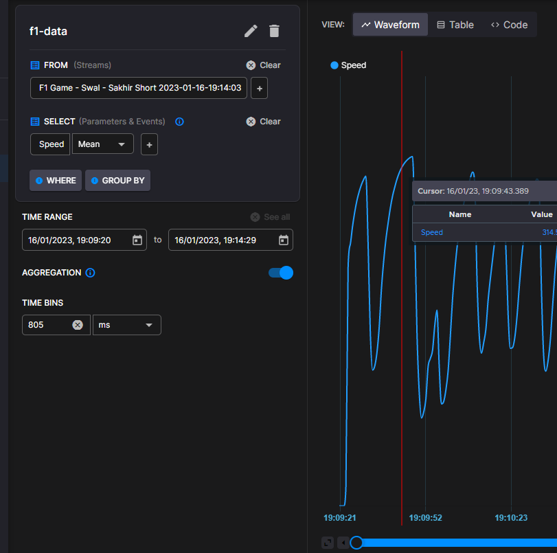
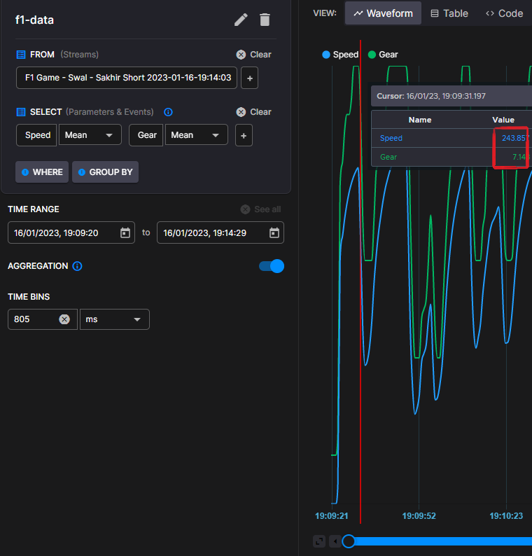

# Publishing data

Quix Streams allows you to publish data using stream context to your topic. It lets you create new streams, append data to existing streams, organize streams in folders, and add context to the streams.

## Connect to Quix

In order to start publishing data to Quix you need an instance of `KafkaStreamingClient`. This is the entry point where you begin publishing to the topics. To create an instance, use the following code:

=== "Python"
	
	``` python
    from quixstreams import KafkaStreamingClient

	client = KafkaStreamingClient('127.0.0.1:9092')
	```

=== "C\#"
	
	``` cs
	var client = new QuixStreams.Streaming.KafkaStreamingClient("127.0.0.1:9092");
	```

You can find other ways to connect to your message broker in the [Connect](connect.md) section.

## Create a topic producer

In order to publish data to a topic you need an instance of `TopicProducer`. This instance allow you to publish data and additional context for streams using the provided topic. You can create an instance using the client’s `get_topic_producer` method, passing the `TOPIC` as the parameter.

=== "Python"
    
    ``` python
    topic_producer = client.get_topic_producer(TOPIC)
    ```

=== "C\#"
    
    ``` cs
    var topicProducer = client.GetTopicProducer(TOPIC);
    ```

## Create / reopen a stream

[Streams](features/streaming-context.md) are the central context of data in Quix Streams. Streams make it easy to manage, discover, and work with your data. You can create as many streams as you want using the `create_stream` method of your `TopicProducer` instance:

=== "Python"
    
    ``` python
    stream = topic_producer.create_stream()
    ```

=== "C\#"
    
    ``` cs
    var stream = topicProducer.CreateStream();
    ```

A stream ID is auto-generated, but you can also pass a `StreamId` to the method to append data to an existing stream. This is also useful when you simply wish to have consistent streamid for to be able to continue the same stream in the future.

=== "Python"
    
    ``` python
    stream = topic_producer.create_stream("existing-stream-id")
    ```

=== "C\#"
    
    ``` cs
    var stream = topicProducer.CreateStream("existing-stream-id");
    ```

### Stream properties

You can add optional context to your streams by adding a name, some metadata or a default location.

You can add using the `Properties` options of the generated `stream` instance:

=== "Python"
    
    ``` python
    stream.properties.name = "Hello World Python stream"
    stream.properties.location = "/test/location"
    stream.properties.metadata["metakey"] = "value"
    stream.properties.metadata["metakey2"] = "value2"
    ```

=== "C\#"
    
    ``` cs
    stream.Properties.Name = "Hello World C# stream";
    stream.Properties.Location = "/test/location";
    stream.Properties.Metadata["metakey"] = "value1";
    stream.Properties.Metadata["metakey2"] = "value2";
    ```

### Stream name

When using Quix SaaS, the stream name is the display name of your stream in the platform. If you specify one, Quix SaaS will use it instead of the Stream Id to represent your stream inside the platform. For example, the following name:

=== "Python"
    
    ``` python
    stream.properties.name = "Hello World my first stream"
    ```

=== "C\#"
    
    ``` cs
    stream.Properties.Name = "Hello World my first stream";
    ```

Would result in this visualization in the list of streams of your workspace:


### Stream location

The stream location property defines a default folder for the stream in the folder structure of your Persisted steams.

For example, the following location:

=== "Python"
    
    ``` python
    stream.properties.location = "/Game/Codemasters/F1-2019/{track}"
    ```

=== "C\#"
    
    ``` cs
    stream.Properties.Location = $"/Game/Codemasters/F1-2019/{track}"
    ```

Would result in this hierarchy:


Any streams sent without a location property will be located under the "Root" level by default.

## Close a stream

Streams can be left open 24/7 if you aren’t sure when the next data will arrive, but they can and should be closed when you know that you won't be publishing any more data to signal consumers the stream is over.

However, sometimes a stream can be closed for other reasons, such as if an error occurs in the publisher code, or something unexpected happens.

These snippets show you how to close a stream and how to specify the `StreamEndType`:

=== "Python"
    
    ``` python
    stream.close()  # same as when used with StreamEndType.Closed
    stream.close(StreamEndType.Closed)
    stream.close(StreamEndType.Aborted)
    stream.close(StreamEndType.Terminated)
    ```

=== "C\#"
    
    ``` cs
    stream.Close(); // same as when used with StreamEndType.Closed
    stream.Close(StreamEndType.Closed);
    stream.Close(StreamEndType.Aborted);
    stream.Close(StreamEndType.Terminated);
    ```

The `StreamEndType` can be one of the following possible end types:

| StreamEndType | Description                                                         |
| ------------- | ------------------------------------------------------------------- |
| Closed        | The stream was closed normally                                      |
| Aborted       | The stream was aborted by your code for your own reasons            |
| Terminated    | The stream was terminated unexpectedly while data was being written |

!!! note
  
  Terminated state is also used when subscribing to a stream but the `StreamConsumer` is closed before the stream concluded for other reasons. This can happen when closing the `TopicConsumer` for example.

## Publishing time-series data

You can now start writing data to your stream. [TimeseriesData](#timeseriesdata-format) is the formal class in Quix Streams which represents a time-series data packet in memory. [TimeseriesData](#timeseriesdata-format) is meant to be used for time-series data coming from sources that generate data at a regular time basis and with a fixed number of Parameters.

!!! tip

	If your data source generates data at irregular time intervals and you don’t have a defined list of regular Parameters, the [EventData](#event-data-format) format is probably a better fit for your time-series data.

### TimeseriesData format

TimeseriesData is the formal class in Quix Streams which represents a time series data packet in memory. The format consists of a list of Timestamps with their corresponding parameter names and values for each timestamp.

You should imagine a TimeseriesData as a table where the Timestamp is the first column of that table and where the parameters are the columns for the values of that table. 

The following table shows an example:

| Timestamp | Speed | Gear |
| --------- | ----- | ---- |
| 1         | 120   | 3    |
| 2         | 123   | 3    |
| 3         | 125   | 3    |
| 6         | 110   | 2    |

!!! tip

	The Timestamp column plus the [Tags](#tags) assigned to it work as the index of the table. If you add values for the same Timestamp and Tags combination, only the last Values will be sent to the stream.

The following code would generate the previous `TimeseriesData` and publish it to the stream:

=== "Python"
    
    ``` python
    from quixstreams import TimeseriesData

    data = TimeseriesData()
    
    data.add_timestamp_nanoseconds(1) \
        .add_value("Speed", 120) \
        .add_value("Gear", 3)
    data.add_timestamp_nanoseconds(2) \
        .add_value("Speed", 123) \
        .add_value("Gear", 3)
    data.add_timestamp_nanoseconds(3) \
        .add_value("Speed", 125) \
        .add_value("Gear", 3)
    data.add_timestamp_nanoseconds(6) \
        .add_value("Speed", 110) \
        .add_value("Gear", 2)
    
    stream.timeseries.publish(data)
    ```

=== "C\#"
    
    ``` cs
    var data = new TimeseriesData();
    
    data.AddTimestampNanoseconds(1)
        .AddValue("Speed", 120)
        .AddValue("Gear", 3);
    data.AddTimestampNanoseconds(2)
        .AddValue("Speed", 123)
        .AddValue("Gear", 3);
    data.AddTimestampNanoseconds(3)
        .AddValue("Speed", 125)
        .AddValue("Gear", 3);
    data.AddTimestampNanoseconds(6)
        .AddValue("Speed", 110)
        .AddValue("Gear", 2);
    
    stream.Timeseries.Publish(data);
    ```

Although Quix Streams allows you to publish `TimeseriesData` to a stream directly, without any buffering, we recommend you use the built-in [Buffer](#using-a-buffer) feature to achieve high throughput speeds. The following code would publish the same `TimeseriesData` through a buffer:

=== "Python"
    
    ``` python
    stream.timeseries.buffer.publish(data)
    ```

=== "C\#"
    
    ``` cs
    stream.Timeseries.Buffer.Publish(data);
    ```

Visit the [Buffer](#using-a-buffer) section of this documentation to find out more about the built-in buffer feature.

Quix Streams allows you to attach numbers, strings, or binary data to your timestamps. The code below will attach one of each to the same timestamp:

=== "Python"
    
    ``` python
    from quixstreams import TimeseriesData
    from datetime import datetime

    data = TimeseriesData()

    data.add_timestamp(datetime.utcnow()) \
        .add_value("ParameterA", 10) \
        .add_value("ParameterB", "hello") \
        .add_value("ParameterC", bytearray("hello, Quix!", 'utf-8'))  # use bytearray to publish binary data to a stream.
    ```

=== "C\#"
    
    ``` cs
    var data = new TimeseriesData();
    
    data.AddTimestamp(DateTime.UtcNow)
        .AddValue("ParameterA", 10)
        .AddValue("ParameterB", "hello")
        .AddValue("ParameterC", Encoding.ASCII.GetBytes("Hello Quix!")); // Publish binary data as a byte array.
    ```

### pandas DataFrame format

If you use the Python version of Quix Streams you can use [pandas DataFrame](features/data-frames.md) for writing time-series data. You just need to use the `publish` methods of the `stream.timeseries` or `stream.timeseries.buffer`, passing the Data Frame instead of a [TimeseriesData](#timeseriesdata-format):

``` python
df = data.to_dataframe()
stream.timeseries.buffer.publish(df)
```

Alternatively, you can convert a pandas DataFrame to a [TimeseriesData](#timeseriesdata-format) using the method `from_dataframe`:

``` python
with (data := TimeseriesData.from_dataframe(df)):
    stream.timeseries.buffer.publish(data)
```

!!! tip

	The conversions from pandas DataFrame to [TimeseriesData](#timeseriesdata-format) have an intrinsic cost overhead. For high-performance models using pandas DataFrame, you should use pandas DataFrame methods provided by Quix Streams that are optimized for doing as few conversions as possible.


### Timestamps

Quix Streams supports common date and time formats for timestamps when adding data to a stream.

There are several helper functions to add new timestamps to `Buffer`, `TimeseriesData`, and `EventData` instances with several types of date/time formats.

These are all the common helper functions:

=== "Python"
    
      - `add_timestamp(datetime: datetime)` : Add a new timestamp in `datetime` format. Default `epoch` will never be added to this.    
      - `add_timestamp(time: timedelta)` : Add a new timestamp in `timedelta` format since the default `epoch` determined in the stream.    
      - `add_timestamp_milliseconds(milliseconds: int)` : Add a new timestamp in milliseconds since the default `epoch` determined in the stream.    
      - `add_timestamp_nanoseconds(nanoseconds: int)` : Add a new timestamp in nanoseconds since the default `epoch` determined in the stream.

=== "C\#"
    
      - `AddTimestamp(DateTime dateTime)` : Add a new timestamp in `DateTime` format. Default `Epoch` will never be added to this.    
      - `AddTimestamp(TimeSpan timeSpan)` : Add a new timestamp in `TimeSpan` format since the default `Epoch` determined in the stream.    
      - `AddTimestampMilliseconds(long timeMilliseconds)` : Add a new timestamp in milliseconds since the default `Epoch` determined in the stream.    
      - `AddTimestampNanoseconds(long timeNanoseconds)` : Add a new timestamp in nanoseconds since the default `Epoch` determined in the stream.

#### Epoch

There is a stream property called `Epoch` (set to 0 by default, meaning 00:00:00 on 1 January 1970) that is added to every timestamp (except for datetime formats) when it’s added to the stream. You can use any value you like to act as a base, from which point timestamps will be relative to.

The following code indicates to Quix Streams to set the current date as epoch and add it to each timestamp added to the stream:

=== "Python"
    
    ``` python
    from datetime import date

    stream.epoch = date.today()
    ```

=== "C\#"
    
    ``` cs
    stream.Epoch = DateTime.Today;
    ```

Adding data without using Epoch property:

=== "Python"
    
    ``` python
    stream.timeseries.buffer \
        .add_timestamp(datetime.datetime.utcnow()) \
        .add_value("ParameterA", 10) \
        .add_value("ParameterB", "hello") \
        .publish()
    ```

=== "C\#"
    
    ``` cs
    stream.Timeseries.Buffer
        .AddTimestamp(DateTime.UtcNow)
        .AddValue("ParameterA", 10)
        .AddValue("ParameterB", "hello")
        .Publish();
    ```

Or we can add a timestamp 1000ms from the epoch *"Today"*:

=== "Python"
    
    ``` python
    stream.epoch = date.today()
    
    stream.timeseries.buffer \
        .add_timestamp_milliseconds(1000) \
        .add_value("ParameterA", 10) \
        .add_value("ParameterB", "hello") \
        .publish()
    ```

=== "C\#"
    
    ``` cs
    stream.Epoch = DateTime.Today;
    
    stream.Timeseries.Buffer
        .AddTimestampInMilliseconds(1000)
        .AddValue("ParameterA", 10)
        .AddValue("ParameterB", "hello")
        .Publish();
    ```

### Using a Buffer

Quix Streams provides you with an optional programmable buffer which you can tailor to your needs. Using buffers to publish data allows you to achieve better compression and higher throughput. 

=== "Python"
    You can use the `buffer` property embedded in the `parameters` property of your `stream`:
    ``` python
    stream.timeseries.buffer.packet_size = 100
    ```

=== "C\#"
    You can use the `Buffer` property embedded in the `Parameters` property of your `stream`:
    ``` cs
    stream.Timeseries.Buffer.PacketSize = 100;
    ```

The code above configures the buffer to publish a packet when the size of the buffer reaches 100 timestamps.

=== "Python"
    Writing a [TimeseriesData](#timeseriesdata-format) to that buffer is as simple as using the `publish` method of that built-in `buffer`:
    ``` python
    stream.timeseries.buffer.publish(data)
    ```

=== "C\#"
    Writing a [TimeseriesData](#timeseriesdata-format) to that buffer is as simple as using the `Publish` method of that built-in `Buffer`:
    ``` cs
    stream.Timeseries.Buffer.Publish(data);
    ```

Quix Streams also allows you to publish data to the buffer without creating a `TimeseriesData` instance explicitly. To do so, you can use the same helper methods that are supported by the `TimeseriesData` class like `add_timestamp`, `add_value` or `add_tag`. Then use the `publish` method to publish that timestamp to the buffer.

=== "Python"
    
    ``` python
    stream.timeseries.buffer \
        .add_timestamp(datetime.utcnow()) \
        .add_value("ParameterA", 10) \
        .add_value("ParameterB", "hello") \
        .add_value("ParameterC", bytearray("hello, Quix!", 'utf-8')) \
        .publish()
    ```

=== "C\#"
    
    ``` cs
    stream.Timeseries.Buffer
        .AddTimestamp(DateTime.UtcNow)
        .AddValue("ParameterA", 10)
        .AddValue("ParameterB", "hello")
        .AddValue("ParameterC", Encoding.ASCII.GetBytes("Hello Quix!")) // Publish binary data as a byte array.
        .Publish();
    ```

You can configure multiple conditions to determine when the Buffer has to release data. If any of these conditions become true, the buffer will release a new packet of data and that data is cleared from the buffer:

=== "Python"
    
      - `buffer.buffer_timeout`: The maximum duration in milliseconds for which the buffer will be held before releasing the data. A packet of data is released when the configured timeout value has elapsed from the last data received in the buffer.    
      - `buffer.packet_size`: The maximum packet size in terms of number of timestamps. Each time the buffer has this number of timestamps, the packet of data is released.    
      - `buffer.time_span_in_nanoseconds`: The maximum time between timestamps in nanoseconds. When the difference between the earliest and latest buffered timestamp surpasses this number, the packet of data is released.    
      - `buffer.time_span_in_milliseconds`: The maximum time between timestamps in milliseconds. When the difference between the earliest and latest buffered timestamp surpasses this number the packet of data is released. Note: This is a millisecond converter on top of `time_span_in_nanoseconds`. They both work with the same underlying value.    
      - `buffer.custom_trigger_before_enqueue`: A custom function which is invoked **before** adding a new timestamp to the buffer. If it returns true, the packet of data is released before adding the timestamp to it.    
      - `buffer.custom_trigger`: A custom function which is invoked **after** adding a new timestamp to the buffer. If it returns true, the packet of data is released with the entire buffer content.    
      - `buffer.filter`: A custom function to filter the incoming data before adding it to the buffer. If it returns true, data is added, otherwise it isn’t.

=== "C\#"
    
      - `Buffer.BufferTimeout`: The maximum duration in milliseconds for which the buffer will be held before releasing the data. A packet of data is released when the configured timeout value has elapsed from the last data received in the buffer.    
      - `Buffer.PacketSize`: The maximum packet size in terms of number of timestamps. Each time the buffer has this number of timestamps, the packet of data is released.    
      - `Buffer.TimeSpanInNanoseconds`: The maximum time between timestamps in nanoseconds. When the difference between the earliest and latest buffered timestamp surpasses this number, the packet of data is released.    
      - `Buffer.TimeSpanInMilliseconds`: The maximum time between timestamps in milliseconds. When the difference between the earliest and latest buffered timestamp surpasses this number, the packet of data is released. Note: This is a millisecond converter on top of `TimeSpanInNanoseconds`. They both work with the same underlying value.    
      - `Buffer.CustomTriggerBeforeEnqueue`: A custom function which is invoked **before** adding a new timestamp to the buffer. If it returns true, the packet of data is released before adding the timestamp to it.    
      - `Buffer.CustomTrigger`: A custom function which is invoked **after** adding a new timestamp to the buffer. If it returns true, the packet of data is released with the entire buffer content.    
      - `Buffer.Filter`: A custom function to filter the incoming data before adding it to the buffer. If it returns true, data is added, otherwise it isn’t.

#### Examples

The following buffer configuration will publish data every 100ms or, if no data is buffered in the 1 second timeout period, it will flush and empty the buffer anyway:

=== "Python"
    
    ``` python
    stream.timeseries.buffer.time_span_in_milliseconds = 100
    stream.timeseries.buffer.buffer_timeout = 1000
    ```

=== "C\#"
    
    ``` cs
    stream.Timeseries.Buffer.TimeSpanInMilliseconds = 100;
    stream.Timeseries.Buffer.BufferTimeout = 1000;
    ```

The following buffer configuration will publish data every 100ms window or if critical data is added to it:

=== "Python"
    
    ``` python
    stream.timeseries.buffer.time_span_in_milliseconds = 100
    stream.timeseries.buffer.custom_trigger = lambda data: data.timestamps[0].tags["is_critical"] == 'True'
    ```

=== "C\#"
    
    ``` cs
    stream.Timeseries.Buffer.TimeSpanInMilliseconds = 100;
    stream.Timeseries.Buffer.CustomTrigger = data => data.Timestamps[0].Tags["is_critical"] == "True";
    ```

### Parameter definitions

Quix Streams allows you to define metadata for parameters and events to describe them. You can define things like human readable names, descriptions, acceptable ranges of values, etc. Quix SaaS uses some of this configuration when visualizing data on the platform, but you can also use them in your own models, bridges, or visualization implementations.

=== "Python"  
    We call this parameter metadata `ParameterDefinitions`, and all you need to do is to use the `add_definition` helper function of the `stream.timeseries` property:
    
    ``` python
    stream.timeseries.add_definition('ParameterIdForCode', 'DisplayNameForHumans', 'Additional Description')
    ```

=== "C\#"  
    We call this parameter metadata `ParameterDefinitions`, and all you need to do is to use the `AddDefinition` helper function of the `stream.timeseries` property:
    
    ``` cs
    stream.Timeseries.AddDefinition("ParameterIdForCode", "DisplayNameForHumans", "Additional Description")
    ```

Once you have added a new definition, you can attach some additional properties to it. This is the list of visualization and metadata options you can attach to a `ParameterDefinition`:

=== "Python"
    
      - `set_range(minimum_value: float, maximum_value: float)` : Set the minimum and maximum range of the parameter.    
      - `set_unit(unit: str)` : Set the unit of the parameter.    
      - `set_format(format: str)` : Set the format of the parameter.    
      - `set_custom_properties(custom_properties: str)` : Set the custom properties of the parameter for your own needs.
    
    Example:
    
    ``` python
    stream.timeseries \
        .add_definition("vehicle-speed", "Vehicle speed", "Current vehicle speed measured using wheel sensor") \
        .set_unit("kmh") \
        .set_range(0, 400)
    ```

=== "C\#"
    
      - `SetRange(double minimumValue, double maximumValue)` : Set the minimum and maximum range of the parameter.    
      - `SetUnit(string unit)` : Set the unit of the parameter.    
      - `SetFormat(string format)` : Set the format of the parameter.    
      - `SetCustomProperties(string customProperties)` : Set the custom properties of the parameter for your own needs
    
    Example:
    
    ``` cs
    stream.Timeseries
        .AddDefinition("vehicle-speed", "Vehicle speed", "Current vehicle speed measured using wheel sensor")
        .SetUnit("kmh")
        .SetRange(0, 400);
    ```

The Min and Max range definition sets the Y axis range in the waveform visualisation view in the Quix SaaS. This definition:

=== "Python"
    
    ``` python
    .add_definition("Speed").set_range(0, 400)
    ```

=== "C\#"
    
    ``` cs
    .AddDefinition("Speed").SetRange(0, 400)
    ```

Will set up this view in Data explorer:



Adding additional `Definitions` for each parameter allows you to see data with different ranges on the same waveform view:



You can also define a `Location` before adding parameter and event definitions. Locations are used to organize the parameters and events in hierarchy groups in the data catalogue. To add a Location you should use the `add_location` method before adding the definitions you want to include in that group.

For example, setting this parameter location:

=== "Python"
    
    ``` python
    stream.timeseries \
        .add_location("/Player/Motion/Car") \
        .add_definition("Pitch") \
        .add_definition("Roll") \
        .add_definition("Yaw")
    ```

=== "C\#"
    
    ``` cs
    stream.Timeseries
        .AddLocation("/Player/Motion/Car")
        .AddDefinition("Pitch")
        .AddDefinition("Roll")
        .AddDefinition("Yaw");
    ```

Will result in this parameter hierarchy in the parameter selection dialogs.

## Writing events

`EventData` is the formal class in Quix Streams which represents an Event data packet in memory. `EventData` is meant to be used when the data is intended to be consumed only as single unit, such as json payload where properties can't be converted to individual parameters. EventData can also be better for non-standard changes such as a machine shutting down might publish an event named ShutDown.

!!! tip

	If your data source generates data at regular time intervals, or the information can be organized in a fixed list of Parameters, the [TimeseriesData](#timeseriesdata-format) format is a better fit for your time-series data.

### EventData format

`EventData` consists of a record with a `Timestamp`, an `EventId` and an `EventValue`.

You should imagine a list of `EventData` instances as a simple table of three columns where the `Timestamp` is the first column of that table and the `EventId` and `EventValue` are the second and third columns, as shown in the following table:

| Timestamp | EventId     | EventValue                 |
| --------- | ----------- | -------------------------- |
| 1         | failure23   | Gearbox has a failure      |
| 2         | box-event2  | Car has entered to the box |
| 3         | motor-off   | Motor has stopped          |
| 6         | race-event3 | Race has finished          |

The following code would generate the list of `EventData` shown in the previous example and publish it to the stream:

=== "Python"
    
    ``` python
    from quixstreams import EventData
    
    stream.events.publish(EventData("failure23", 1, "Gearbox has a failure"))
    stream.events.publish(EventData("box-event2", 2, "Car has entered to the box"))
    stream.events.publish(EventData("motor-off", 3, "Motor has stopped"))
    stream.events.publish(EventData("race-event3", 6, "Race has finished"))
    ```

=== "C\#"
    
    ``` cs
    stream.Events.Publish(new EventData("failure23", 1, "Gearbox has a failure"));
    stream.Events.Publish(new EventData("box-event2", 2, "Car has entered to the box"));
    stream.Events.Publish(new EventData("motor-off", 3, "Motor has stopped"));
    stream.Events.Publish(new EventData("race-event3", 6, "Race has finished"));
    ```

Quix Streams lets you publish Events without creating `EventData` instances explicitly. To do so, you can use similar helpers to those present in [TimeseriesData](#timeseriesdata-format) format such as `add_timestamp`, `add_value` or `add_tag`. Then use the `publish` method to publish that timestamp to the stream.

=== "Python"
    
    ``` python
    stream.events \
        .add_timestamp(1) \
        .add_value("failure23", "Gearbox has a failure") \
        .publish()
    stream.events \
        .add_timestamp(2) \
        .add_value("box-event2", "Car has entered to the box") \
        .publish()
    stream.events \
        .add_timestamp(3) \
        .add_value("motor-off", "Motor has stopped") \
        .publish()
    stream.events \
        .add_timestamp(6) \
        .add_value("race-event3", "Race has finished") \
        .publish()
    ```

=== "C\#"
    
    ``` cs
    stream.Events
        .AddTimestamp(1)
        .AddValue("failure23", "Gearbox has a failure")
        .Publish();
    stream.Events
        .AddTimestamp(2)
        .AddValue("box-event2", "Car has entered to the box")
        .Publish();
    stream.Events
        .AddTimestamp(3)
        .AddValue("motor-off", "Motor has stopped")
        .Publish();
    stream.Events
        .AddTimestamp(6)
        .AddValue("race-event3", "Race has finished")
        .Publish();
    ```

### Event definitions

As with parameters, you can attach `Definitions` to each event.

This is the whole list of visualization and metadata options we can attach to a `EventDefinition`:

  - `set_level(level: EventLevel)` : Set severity level of the event.
  - `set_custom_properties(custom_properties: str)` : Set the custom properties of the event for your own needs.

For example, the following code defines a human readable name and a Severity level for the `EventA`:

=== "Python"
    
    ``` python
    from quixstreams import EventLevel
    stream.events \
        .add_definition("EventA", "The Event A") \
        .set_level(EventLevel.Critical) \
        .set_custom_properties("{this could be a json}")
    ```

=== "C\#"
    
    ``` cs
    stream.Events.AddDefinition("EventA", "The Event A").SetLevel(EventLevel.Critical).SetCustomProperties("{this could be a json}");
    ```

## Tags

The library allows you to tag data for `TimeseriesData` and `EventData` packets. Using tags alongside parameters and events helps when indexing persisted data in the database. Tags allow you to filter and group data with fast queries.

Tags work as a part of the primary key inside `TimeseriesData` and `EventData`, in combination with the default Timestamp key. If you add data values with the same Timestamps, but a different combination of Tags, the timestamp will be treated as a separate row.

For example, the following code:

=== "Python"
    
    ``` python
    from quixstreams import TimeseriesData

    data = TimeseriesData()
    
    data.add_timestamp_nanoseconds(1) \
        .add_tag("CarId", "car1") \
        .add_value("Speed", 120) \
        .add_value("Gear", 3)
    data.add_timestamp_nanoseconds(2) \
        .add_tag("CarId", "car1") \
        .add_value("Speed", 123) \
        .add_value("Gear", 3)
    data.add_timestamp_nanoseconds(3) \
        .add_tag("CarId", "car1") \
        .add_value("Speed", 125) \
        .add_value("Gear", 3)
    
    data.add_timestamp_nanoseconds(1) \
        .add_tag("CarId", "car2") \
        .add_value("Speed", 95) \
        .add_value("Gear", 2)
    data.add_timestamp_nanoseconds(2) \
        .add_tag("CarId", "car2") \
        .add_value("Speed", 98) \
        .add_value("Gear", 2)
    data.add_timestamp_nanoseconds(3) \
        .add_tag("CarId", "car2") \
        .add_value("Speed", 105) \
        .add_value("Gear", 2)
    ```

=== "C\#"
    
    ``` cs
    var data = new TimeseriesData();
    
    data.AddTimestampNanoseconds(1)
        .AddTag("CarId", "car1")
        .AddValue("Speed", 120)
        .AddValue("Gear", 3);
    data.AddTimestampNanoseconds(2)
        .AddTag("CarId", "car1")
        .AddValue("Speed", 123)
        .AddValue("Gear", 3);
    data.AddTimestampNanoseconds(3)
        .AddTag("CarId", "car1")
        .AddValue("Speed", 125)
        .AddValue("Gear", 3);
    
    data.AddTimestampNanoseconds(1)
        .AddTag("CarId", "car2")
        .AddValue("Speed", 95)
        .AddValue("Gear", 2);
    data.AddTimestampNanoseconds(2)
        .AddTag("CarId", "car2")
        .AddValue("Speed", 98)
        .AddValue("Gear", 2);
    data.AddTimestampNanoseconds(3)
        .AddTag("CarId", "car2")
        .AddValue("Speed", 105)
        .AddValue("Gear", 2);
    ```

Will generate the following `TimeseriesData` packet with tagged data:

| Timestamp | CarId | Speed | Gear |
| --------- | ----- | ----- | ---- |
| 1         | car1  | 120   | 3    |
| 1         | car2  | 95    | 2    |
| 2         | car1  | 123   | 3    |
| 2         | car2  | 98    | 2    |
| 3         | car1  | 125   | 3    |
| 3         | car2  | 105   | 2    |

!!! warning

	Tags have to be chosen carefully as excessive cardinality leads to performance degradation in the database. You should use tags only for identifiers and not cardinal values.

The following example of good tagging practice enables you to query the maximum speed for driver identifier "Peter":

=== "Python"
    
    ``` python
    stream.timeseries.buffer \
        .add_timestamp(datetime.datetime.utcnow()) \
        .add_tag("vehicle-plate", "SL96 XCX") \
        .add_tag("driver-id", "Peter") \
        .add_value("Speed", 53) \
        .add_value("Gear", 4) \
        .publish()
    ```

=== "C\#"
    
    ``` cs
    stream.Timeseries.Buffer
        .AddTimestamp(DateTime.UtcNow)
        .AddTag("vehicle-plate", "SL96 XCX")
        .AddTag("driver-id", "Peter")
        .AddValue("Speed", 53)
        .AddValue("Gear", 4)
        .Publish();
    ```

The following example of bad tagging practice will lead to excessive cardinality as there will be a large number of different values for the specified tag, Speed:

=== "Python"
    
    ``` python
    stream.timeseries.buffer \
        .add_timestamp(datetime.datetime.utcnow()) \
        .add_tag("Speed", 53) \
        .add_value("Gear", 4) \
        .publish()
    ```

=== "C\#"
    
    ``` cs
    stream.Timeseries.Buffer
        .AddTimestamp(DateTime.UtcNow)
        .AddTag("Speed", 53)
        .AddValue("Gear", 4)
        .Publish();
    ```

## Minimal example

This is a minimal code example you can use to publish data to a topic using Quix Streams:

=== "Python"
    
    ``` python
    import time
    import datetime
    
    from quixstreams import *
    
    client = KafkaStreamingClient('127.0.0.1:9092')
    
    with (topic_producer := client.get_topic_producer(TOPIC_ID)):
        
        stream = topic_producer.create_stream()
        
        stream.properties.name = "Hello World python stream"
        
        for index in range(0, 3000):
            stream.timeseries \
                .buffer \
                .add_timestamp(datetime.datetime.utcnow()) \
                .add_value("ParameterA", index) \
                .publish()
            time.sleep(0.01)
        print("Closing stream")
        stream.close()
    ```

=== "C\#"
    
    ``` cs
    using System;
    using System.Threading;
    
    namespace WriteHelloWorld
    {
        class Program
        {
            /// <summary>
            /// Main will be invoked when you run the application
            /// </summary>
            static void Main()
            {
                // Create a client which holds generic details for creating input and output topics
                var client = new QuixStreams.Streaming.QuixStreamingClient();
    
                using var topicProducer = client.GetTopicProducer(TOPIC_ID);
    
                var stream = topicProducer.CreateStream();
    
                stream.Properties.Name = "Hello World stream";
    
                Console.WriteLine("Publishing values for 30 seconds");
                for (var index = 0; index < 3000; index++)
                {
                    stream.Timeseries.Buffer
                        .AddTimestamp(DateTime.UtcNow)
                        .AddValue("ParameterA", index)
                        .Publish();
    
                    Thread.Sleep(10);
                }
    
                Console.WriteLine("Closing stream");
                stream.Close();
                Console.WriteLine("Done!");
            }
        }
    }
    ```

## Publish raw Kafka messages

Quix Streams uses an internal protocol which is both data and speed optimized so we do encourage you to use it, but you need to use Quix Streams on both producer and consumer sides as of today. We have plans to support most common formats in near future, but custom formats will always need to be handled manually.

For this, we have created a way to [publish](publish.md#publish-raw-kafka-messages) and [subscribe](subscribe.md#subscribe-raw-kafka-messages) to the raw, unformatted messages and work with them as bytes. This gives you the ability to implement the protocol as needed and convert between formats.

You can publish messages with or without a key. The following example demonstrates how to publish two messages to Kafka, one message with a key, and one without:

=== "Python"
    
    ``` python
    with (producer := client.create_raw_topic_producer(TOPIC_ID)):    
        data = bytearray(bytes("TEXT CONVERTED TO BYTES",'utf-8'))
        
        #publish value with KEY to kafka
        message = RawMessage(data)
        message.key = MESSAGE_KEY
        producer.publish(message)
        
        #publish value without key into kafka
        producer.publish(data)
    ```

=== "C\#"
    
    ``` cs
    using var producer = client.GetRawTopicProducer(TOPIC_ID);
    
    var data = new byte[]{1,3,5,7,1,43};
    
    //Publish value with KEY to kafka
    producer.Publish(new Streaming.Raw.RawMessage(
        MESSAGE_KEY,
        data
    ));
    
    //Publish value withhout key to kafka
    producer.Publish(new Streaming.Raw.RawMessage(
        data
    ));
    
    ```
