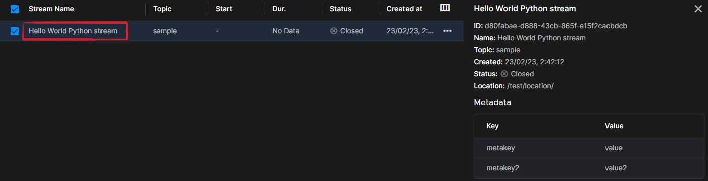
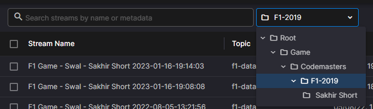
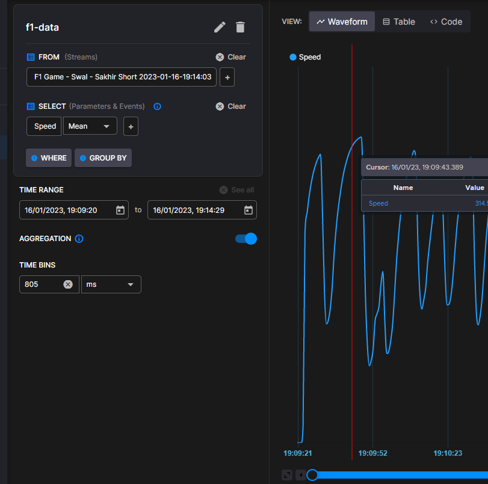
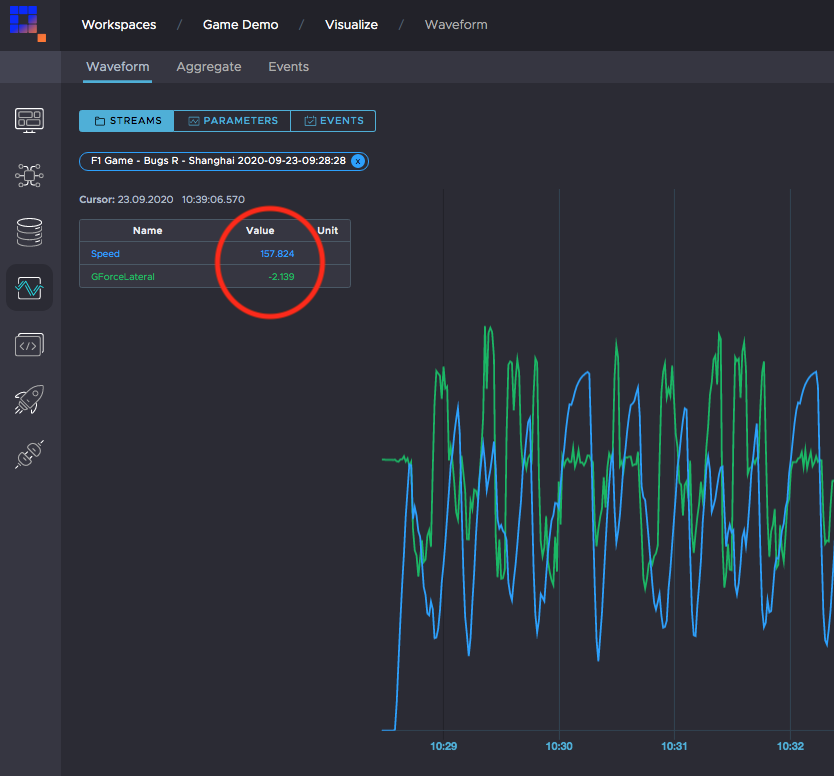
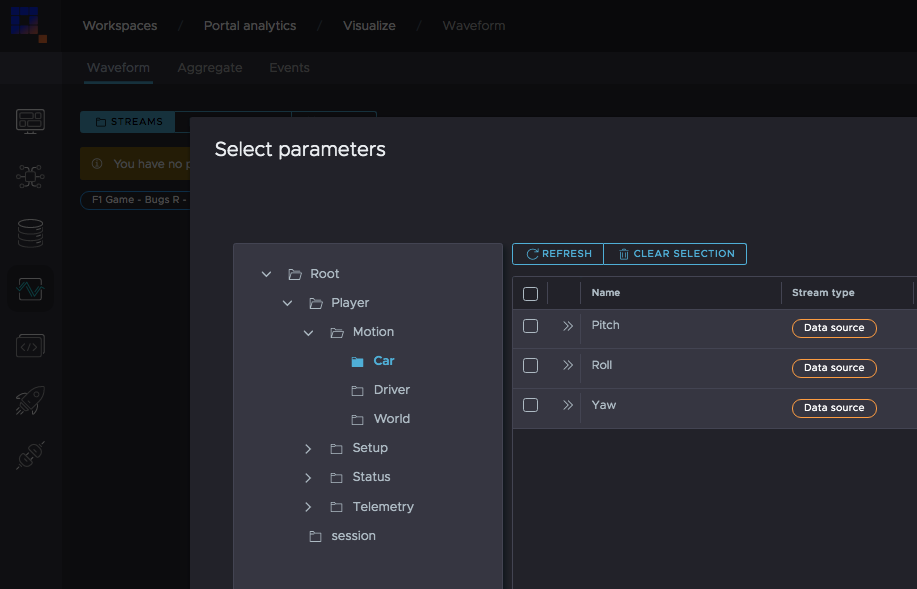

# Writing time-series data

You write data to Quix using streams in your topic. The Quix SDK allows you to create new streams, append data to existing streams, organize streams in folders, and add context data to the streams.

All the necessary code to write data to your Quix Workspace is auto-generated when you create a project using the existing templates. In this section, we explain more in-depth how to write data using the Quix SDK.

!!! tip

	The [Quix Portal](https://portal.platform.quix.ai){target=_blank} offers you easy-to-use, auto-generated examples for reading, writing, and processing data. These examples work directly with your workspace Topics. You can deploy these examples in our serverless environment with just a few clicks. For a quick test of the capabilities of the SDK, we recommend starting with those auto-generated examples.

## Connect to Quix

In order to start writing data to Quix you need an instance of the Quix client, `QuixStreamingClient`. This is the central point where you interact with the main SDK operations.

You can create an instance of `QuixStreamingClient` using the proper constructor of the SDK, as shown here:

=== "Python"
    
    ``` python
    client = QuixStreamingClient()
    ```

=== "C\#"
    
    ``` cs
    var client = new Quix.Sdk.Streaming.QuixStreamingClient();
    ```

You can find more advanced information on how to connect to Quix in the [Connect to Quix](/sdk/connect) section.

## Open a topic

Topics are the default environment for input/output real-time operations on Quix.

In order to access that topic for writing you need an instance of `OutputTopic`. You can create an instance of `OutputTopic` using the client’s `open_output_topic` method, passing the `TOPIC_ID` or the `TOPIC_NAME` as a parameter.

=== "Python"
    
    ``` python
    output_topic = client.open_output_topic(TOPIC_ID)
    ```

=== "C\#"
    
    ``` cs
    var outputTopic = client.OpenOutputTopic(TOPIC_ID);
    ```

## Create / Attach to a Stream

[Streams](/sdk/features/streaming-context) are the central context of data in Quix. Streams make it easy to manage, discover, and work with your data. They are key to good data governance in your organization. Also, Streams are vital for [parallelizing](/sdk/features/horizontal-scaling) huge data loads with an infinite number of data sources.

You can create as many streams as you want using the `create_stream` method of your `OutputTopic` instance:

=== "Python"
    
    ``` python
    stream = output_topic.create_stream()
    ```

=== "C\#"
    
    ``` cs
    var stream = outputTopic.CreateStream();
    ```

A stream ID is auto-generated, but you can also pass a `StreamId` to the method to append or update data of an existing stream:

=== "Python"
    
    ``` python
    stream = output_topic.create_stream("existing-stream-id")
    ```

=== "C\#"
    
    ``` cs
    var stream = outputTopic.CreateStream("existing-stream-id");
    ```

### Stream Properties

As an option, you can add context to your streams by adding a name, some metadata, or a default location.

You can add this metadata to a stream using the `Properties` options of the generated `stream` instance:

=== "Python"
    
    ``` python
    stream.properties.name = "Hello World Python stream"
    stream.properties.location = "/test/location"
    stream.properties.metadata["meta"] = "is"
    stream.properties.metadata["working"] = "well"
    ```

=== "C\#"
    
    ``` cs
    stream.Properties.Name = "Hello World C# stream";
    stream.Properties.Location = "/test/location";
    stream.Properties.Metadata["meta"] = "is";
    stream.Properties.Metadata["working"] = "well";
    ```

### Stream Name

The stream name is the display name of your stream in the platform. If you specify one, Quix will use it instead of the Stream Id to represent your stream inside the platform.

For example, the following name:

=== "Python"
    
    ``` python
    stream.properties.name = "Hello World my first stream"
    ```

=== "C\#"
    
    ``` cs
    stream.Properties.Name = "Hello World my first stream";
    ```

Would result in this visualization in the list of streams of your workspace:



### Stream Location

The stream location property defines a default folder for the stream in the folder structure of your Persisted steams.

For example, the following location:

=== "Python"
    
    ``` python
    stream.properties.location = "/Game/Codemasters/F1-2019/{track}"
    ```

=== "C\#"
    
    ``` cs
    stream.Properties.Location = $"/Game/Codemasters/F1-2019/{track}"
    ```

Would result in this hierarchy:



Any streams sent without a location property will be located under the "Root" level by default.

## Close a Stream

Streams can be left open 24/7 if you aren’t sure when the next data will arrive, but they can and should be closed when you know that you have all the data you need. They will also be closed automatically when your service stops.

However, sometimes a stream can be closed for other reasons, such as if an error occurs in the writer code, or something unexpected happens.

These snippets show you how to close a stream and how to specify the `StreamEndType`:

=== "Python"
    
    ``` python
    stream.close()
    stream.close(StreamEndType.Closed)
    stream.close(StreamEndType.Aborted)
    stream.close(StreamEndType.Terminated)
    ```

=== "C\#"
    
    ``` cs
    stream.Close();
    stream.Close(StreamEndType.Closed);
    stream.Close(StreamEndType.Aborted);
    stream.Close(StreamEndType.Terminated);
    ```

The `StreamEndType` can be one of the following possible end types:

| StreamEndType | Description                                                         |
| ------------- | ------------------------------------------------------------------- |
| Closed        | The stream was closed normally                                      |
| Aborted       | The stream was aborted by your code for your own reasons            |
| Terminated    | The stream was terminated unexpectedly while data was being written |

## Writing Parameter Data

You can now start writing data to your stream. [ParameterData](#parameter-data-format) is the formal class in the SDK which represents a time-series data packet in memory. [ParameterData](#parameter-data-format) is meant to be used for time-series data coming from sources that generate data at a regular time basis and with a fixed number of Parameters.

!!! tip

	If your data source generates data at irregular time intervals and you don’t have a defined list of regular Parameters, the [EventData](#event-data-format) format is probably a better fit for your time-series data.

### Parameter Data format

[ParameterData](#parameter-data-format) is the formal class in the SDK which represents a time-series data packet in memory.

[ParameterData](#parameter-data-format) consists of a list of Timestamps with their corresponding Parameter Names and Values for each timestamp.

You should imagine a Parameter Data as a table where the Timestamp is the first column of that table and where the Parameters are the columns for the Values of that table.

The following table shows an example of Parameter Data:

| Timestamp | Speed | Gear |
| --------- | ----- | ---- |
| 1         | 120   | 3    |
| 2         | 123   | 3    |
| 3         | 125   | 3    |
| 6         | 110   | 2    |

!!! tip

	The Timestamp column plus the [Tags](#tags) assigned to it work as the index of that table. If you add values for the same Timestamp and Tags combination, only the last Values will be sent to the stream.

The Quix SDK provides several helpers to create and send `ParameterData` packets through the stream.

The following code would generate the previous `ParameterData` and send it to the stream:

=== "Python"
    
    ``` python
    data = ParameterData()
    
    data.add_timestamp_nanoseconds(1) \
        .add_value("Speed", 120) \
        .add_value("Gear", 3)
    data.add_timestamp_nanoseconds(2) \
        .add_value("Speed", 123) \
        .add_value("Gear", 3)
    data.add_timestamp_nanoseconds(3) \
        .add_value("Speed", 125) \
        .add_value("Gear", 3)
    data.add_timestamp_nanoseconds(6) \
        .add_value("Speed", 110) \
        .add_value("Gear", 2)
    
    stream.parameters.write(data)
    ```

=== "C\#"
    
    ``` cs
    var data = new ParameterData();
    
    data.AddTimestampNanoseconds(1)
        .AddValue("Speed", 120)
        .AddValue("Gear", 3);
    data.AddTimestampNanoseconds(2)
        .AddValue("Speed", 123)
        .AddValue("Gear", 3);
    data.AddTimestampNanoseconds(3)
        .AddValue("Speed", 125)
        .AddValue("Gear", 3);
    data.AddTimestampNanoseconds(6)
        .AddValue("Speed", 110)
        .AddValue("Gear", 2);
    
    stream.Parameters.Write(data);
    ```

Although Quix allows you to send `ParameterData` to a stream directly, without any buffering, Quix recommendeds you use the built-in [Buffer](#buffer) feature to achieve high throughput speeds. The following code would send the same `ParameterData` through a buffer:

=== "Python"
    
    ``` python
    stream.parameters.buffer.write(data)
    ```

=== "C\#"
    
    ``` cs
    stream.Parameters.Buffer.Write(data);
    ```

Visit the [Buffer](#buffer) section of this documentation to find out more about the built-in Buffer feature.

The Quix SDK allows you to attach any type of data — Numbers, Strings, or raw Binary data — to your timestamps. The following code will attach one of each to the same timestamp:

=== "Python"
    
    ``` python
    data = ParameterData()
    
    data.add_timestamp(datetime.datetime.utcnow()) \
        .add_value("ParameterA", 10) \
        .add_value("ParameterB", "hello") \
        .add_value("ParameterC", bytearray("hello, Quix!", 'utf-8')) # use bytearray to write binary data to a stream.
    ```

=== "C\#"
    
    ``` cs
    var data = new ParameterData();
    
    data.AddTimestamp(DateTime.UtcNow)
        .AddValue("ParameterA", 10)
        .AddValue("ParameterB", "hello")
        .AddValue("ParameterC", Encoding.ASCII.GetBytes("Hello Quix!")); // Write binary data as a byte array.
    ```

### Timestamps

The Quix SDK supports common date and time formats for timestamps when adding data to a stream.

The SDK gives you several helper functions to add new timestamps to `Buffer`, `ParamaterData`, and `EventData` instances with several types of date/time formats.

These are all the common helper functions:

=== "Python"
    
      - `add_timestamp(datetime: datetime)` : Add a new timestamp in `datetime` format. Default `epoch` will never be added to this.
    
      - `add_timestamp(time: timedelta)` : Add a new timestamp in `timedelta` format since the default `epoch` determined in the stream.
    
      - `add_timestamp_milliseconds(milliseconds: int)` : Add a new timestamp in milliseconds since the default `epoch` determined in the stream.
    
      - `add_timestamp_nanoseconds(nanoseconds: int)` : Add a new timestamp in nanoseconds since the default `epoch` determined in the stream.

=== "C\#"
    
      - `AddTimestamp(DateTime dateTime)` : Add a new timestamp in `DateTime` format. Default `Epoch` will never be added to this.
    
      - `AddTimestamp(TimeSpan timeSpan)` : Add a new timestamp in `TimeSpan` format since the default `Epoch` determined in the stream.
    
      - `AddTimestampMilliseconds(long timeMilliseconds)` : Add a new timestamp in milliseconds since the default `Epoch` determined in the stream.
    
      - `AddTimestampNanoseconds(long timeNanoseconds)` : Add a new timestamp in nanoseconds since the default `Epoch` determined in the stream.

#### Epoch

There is a stream property called `Epoch` (set to 0 by default) that is added to every timestamp (except for datetime formats) when it’s added to the stream. You can use any value you like to act as a base, from which point timestamps will be relative to.

The following code indicates to the SDK to add the current date/time to each timestamp added to the stream:

=== "Python"
    
    ``` python
    stream.epoch = date.today()
    ```

=== "C\#"
    
    ``` cs
    stream.Epoch = DateTime.Today;
    ```

Adding data without using Epoch property:

=== "Python"
    
    ``` python
    stream.parameters.buffer \
        .add_timestamp(datetime.datetime.utcnow()) \
        .add_value("ParameterA", 10) \
        .add_value("ParameterB", "hello") \
        .write()
    ```

=== "C\#"
    
    ``` cs
    stream.Parameters.Buffer
        .AddTimestamp(DateTime.UtcNow)
        .AddValue("ParameterA", 10)
        .AddValue("ParameterB", "hello")
        .Write();
    ```

Or we can add a timestamp 1000ms from the epoch *"Today"*:

=== "Python"
    
    ``` python
    stream.epoch = date.today()
    
    stream.parameters.buffer \
        .add_timestamp_milliseconds(1000) \
        .add_value("ParameterA", 10) \
        .add_value("ParameterB", "hello") \
        .write()
    ```

=== "C\#"
    
    ``` cs
    stream.Epoch = DateTime.Today;
    
    stream.Parameters.Buffer
        .AddTimestampInMilliseconds(1000)
        .AddValue("ParameterA", 10)
        .AddValue("ParameterB", "hello")
        .Write();
    ```

### Buffer

The Quix SDK provides a built in `Buffer` to help you achieve high-performance data streaming without the complexity of managing underlying streaming technologies. Instead, you just have to configure the buffer with your requirements using the property `Buffer` present in the `Parameters` property of your stream.

For example, the following configuration means that the SDK will send a packet when the size of the buffer reaches 100 timestamps:

=== "Python"
    
    ``` python
    stream.parameters.buffer.packet_size = 100
    ```

=== "C\#"
    
    ``` cs
    stream.Parameters.Buffer.PacketSize = 100;
    ```

Writing a [ParameterData](#parameter-data-format) to that buffer is as simple as using the `Write` method of that built-in `Buffer`, passing the `ParameterData` to write:

=== "Python"
    
    ``` python
    stream.parameters.buffer.write(data)
    ```

=== "C\#"
    
    ``` cs
    stream.Parameters.Buffer.Write(data);
    ```

The Quix SDK also allows you to write data to the buffer without creating a `ParameterData` instance explicitly. To do so, you can use the same helper methods that are supported by the `ParameterData` class like `add_timestamp`, `add_value` or `add_tag`. Then use the `write` method to write that timestamp to the buffer.

The following code is an example of how to write data to the buffer without using an explicit `ParameterData` instance:

=== "Python"
    
    ``` python
    stream.parameters.buffer \
        .add_timestamp(datetime.datetime.utcnow()) \
        .add_value("ParameterA", 10) \
        .add_value("ParameterB", "hello") \
        .add_value("ParameterC", bytearray("hello, Quix!", 'utf-8')) # use bytearray to write binary data to a stream.
        .write()
    ```

=== "C\#"
    
    ``` cs
    stream.Parameters.Buffer
        .AddTimestamp(DateTime.UtcNow)
        .AddValue("ParameterA", 10)
        .AddValue("ParameterB", "hello")
        .AddValue("ParameterC", Encoding.ASCII.GetBytes("Hello Quix!")) // Write binary data as a byte array.
        .Write();
    ```

You can configure multiple conditions to determine when the Buffer has to release data. If any of these conditions become true, the buffer will release a new packet of data and that data is cleared from the buffer:

=== "Python"
    
      - `buffer.buffer_timeout`: The maximum duration in milliseconds for which the buffer will be held before releasing the data. A packet of data is released when the configured timeout value has elapsed from the last data received in the buffer.
    
      - `buffer.packet_size`: The maximum packet size in terms of number of timestamps. Each time the buffer has this number of timestamps, the packet of data is released.
    
      - `buffer.time_span_in_nanoseconds`: The maximum time between timestamps in nanoseconds. When the difference between the earliest and latest buffered timestamp surpasses this number, the packet of data is released.
    
      - `buffer.time_span_in_milliseconds`: The maximum time between timestamps in milliseconds. When the difference between the earliest and latest buffered timestamp surpasses this number the packet of data is released. Note: This is a millisecond converter on top of `time_span_in_nanoseconds`. They both work with the same underlying value.
    
      - `buffer.custom_trigger_before_enqueue`: A custom function which is invoked **before** adding a new timestamp to the buffer. If it returns true, the packet of data is released before adding the timestamp to it.
    
      - `buffer.custom_trigger`: A custom function which is invoked **after** adding a new timestamp to the buffer. If it returns true, the packet of data is released with the entire buffer content.
    
      - `buffer.filter`: A custom function to filter the incoming data before adding it to the buffer. If it returns true, data is added, otherwise it isn’t.

=== "C\#"
    
      - `Buffer.BufferTimeout`: The maximum duration in milliseconds for which the buffer will be held before releasing the data. A packet of data is released when the configured timeout value has elapsed from the last data received in the buffer.
    
      - `Buffer.PacketSize`: The maximum packet size in terms of number of timestamps. Each time the buffer has this number of timestamps, the packet of data is released.
    
      - `Buffer.TimeSpanInNanoseconds`: The maximum time between timestamps in nanoseconds. When the difference between the earliest and latest buffered timestamp surpasses this number, the packet of data is released.
    
      - `Buffer.TimeSpanInMilliseconds`: The maximum time between timestamps in milliseconds. When the difference between the earliest and latest buffered timestamp surpasses this number, the packet of data is released. Note: This is a millisecond converter on top of `time_span_in_nanoseconds`. They both work with the same underlying value.
    
      - `Buffer.CustomTriggerBeforeEnqueue`: A custom function which is invoked **before** adding a new timestamp to the buffer. If it returns true, the packet of data is released before adding the timestamp to it.
    
      - `Buffer.CustomTrigger`: A custom function which is invoked **after** adding a new timestamp to the buffer. If it returns true, the packet of data is released with the entire buffer content.
    
      - `Buffer.Filter`: A custom function to filter the incoming data before adding it to the buffer. If it returns true, data is added, otherwise it isn’t.

#### Examples

The following buffer configuration will send data every 100ms or, if no data is buffered in the 1 second timeout period, it will flush and empty the buffer anyway:

=== "Python"
    
    ``` python
    stream.parameters.buffer.time_span_in_milliseconds = 100
    stream.parameters.buffer.buffer_timeout = 1000
    ```

=== "C\#"
    
    ``` cs
    stream.Parameters.Buffer.TimeSpanInMilliseconds = 100;
    stream.Parameters.Buffer.BufferTimeout = 1000;
    ```

The following buffer configuration will send data every 100ms window or if critical data arrives:

=== "Python"
    
    ``` python
    stream.parameters.buffer.time_span_in_milliseconds = 100
    stream.parameters.buffer.custom_trigger = lambda data: data.timestamps[0].tags["is_critical"] == 'True'
    ```

=== "C\#"
    
    ``` cs
    stream.Parameters.Buffer.TimeSpanInMilliseconds = 100;
    stream.Parameters.Buffer.CustomTrigger = data => data.Timestamps[0].Tags["is_critical"] == "True";
    ```

### Parameter Definitions

The Quix SDK allows you to define metadata for parameters and events, to describe them. You can define things like human readable names, descriptions, acceptable ranges of values, etc. Quix uses some of this configuration when visualizing data on the platform, but you can also use them in your own models, bridges, or visualization implementations.

=== "Python"  
    We call this parameter metadata `ParameterDefinitions`, and all you need to do is to use the `add_definition` helper function of the `stream.parameters` property:
    
    ``` python
    parameters.add_definition(parameter_id: str, name: str = None, description: str = None)
    ```

=== "C\#"  
    We call this parameter metadata `ParameterDefinitions`, and all you need to do is to use the `AddDefinition` helper function of the `stream.Parameters` property:
    
    ``` cs
    Parameters.AddDefinition(parameterId: string, name: string = null, description: string = null)
    ```

Once you have added a new definition, you can attach some additional configuration to it. This is the list of visualization and metadata options you can attach to a `ParameterDefinition`:

=== "Python"
    
      - `set_range(minimum_value: float, maximum_value: float)` : Set the minimum and maximum range of the parameter.
    
      - `set_unit(unit: str)` : Set the unit of the parameter.
    
      - `set_format(format: str)` : Set the format of the parameter.
    
      - `set_custom_properties(custom_properties: str)` : Set the custom properties of the parameter.
    
    Example:
    
    ``` python
    stream.parameters \
        .add_location("vehicle/ecu") \
        .add_definition("vehicle-speed", "Vehicle speed", "Current vehicle speed measured using wheel sensor") \
        .set_unit("kmh") \
        .set_range(0, 400)
    ```

=== "C\#"
    
      - `SetRange(double minimumValue, double maximumValue)` : Set the minimum and maximum range of the parameter.
    
      - `SetUnit(string unit)` : Set the unit of the parameter.
    
      - `SetFormat(string format)` : Set the format of the parameter.
    
      - `SetCustomProperties(string customProperties)` : Set the custom properties of the parameter.
    
    Example:
    
    ``` cs
    stream.Parameters
        .AddLocation("vehicle/ecu")
        .AddDefinition("vehicle-speed", "Vehicle speed", "Current vehicle speed measured using wheel sensor")
        .SetUnit("kmh")
        .SetRange(0, 400);
    ```

The Min and Max range definition sets the Y axis range in the waveform visualisation view. This definition:

=== "Python"
    
    ``` python
    .add_definition("Speed").set_range(0, 400)
    ```

=== "C\#"
    
    ``` cs
    .AddDefinition("Speed").SetRange(0, 400)
    ```

Will set up this view in Visualize:



Adding additional `Definitions` for each parameter allows you to see data with different ranges on the same waveform view:



You can also define a `Location` before adding parameter and event definitions. Locations are used to organize the Parameters and Events in hierarchy groups in the data catalogue. To add a Location you should use the `add_location` method before adding the definitions you want to include in that group.

For example, setting this parameter location:

=== "Python"
    
    ``` python
    stream.parameters \
        .add_location("/Player/Motion/Car") \
        .add_definition("Pitch") \
        .add_definition("Roll") \
        .add_definition("Yaw")
    ```

=== "C\#"
    
    ``` cs
    stream.Parameters
        .AddLocation("/Player/Motion/Car")
        .AddDefinition("Pitch")
        .AddDefinition("Roll")
        .AddDefinition("Yaw");
    ```

Will result in this parameter hierarchy in the parameter selection dialog:



### Using Data Frames

If you use the Python version of the SDK you can use [Pandas DataFrames](https://pandas.pydata.org/docs/user_guide/dsintro.html#dataframe){target=_blank} for reading and writing ParameterData to Quix. The Pandas DataFrames format is just a representation of [ParameterData](#parameter-data-format) format, where the Timestamp is mapped to a column named `time` and the rest of the parameters are mapped as columns named as the ParameterId of the parameter. Tags are mapped as columns with the prefix `TAG__` and the TagId of the tag.

For example, the following [ParameterData](#parameter-data-format):

| Timestamp | CarId (tag) | Speed | Gear |
| --------- | ----------- | ----- | ---- |
| 1         | car-1       | 120   | 3    |
| 2         | car-2       | 123   | 3    |
| 3         | car-1       | 125   | 3    |
| 6         | car-2       | 110   | 2    |

Is represented as the following Pandas DataFrame:

| time | TAG\_\_CarId | Speed | Gear |
| ---- | ------------ | ----- | ---- |
| 1    | car-1        | 120   | 3    |
| 2    | car-2        | 123   | 3    |
| 3    | car-1        | 125   | 3    |
| 6    | car-2        | 110   | 2    |

The SDK allows you to write data to Quix using [Pandas DataFrames](https://pandas.pydata.org/docs/user_guide/dsintro.html#dataframe){target=_blank} directly. You just need to use the common `write` methods of the `stream.parameters` and `buffer`, passing the Data Frame instead of a [ParameterData](#parameter-data-format):

``` python
df = data.to_panda_frame()
stream.parameters.buffer.write(df)
```

Alternatively, you can convert a Pandas Data Frame to a [ParameterData](#parameter-data-format) using the method `from_panda_frame`:

``` python
data = ParameterData.from_panda_frame(df)
with data:
    stream.parameters.buffer.write(data)
```

!!! tip

	The conversions from Pandas DataFrames to [ParameterData](#parameter-data-format) have an intrinsic cost overhead. For high-performance models using Pandas DataFrames, you should use Pandas DataFrames methods provided by the SDK that are optimized for doing as few conversions as possible.

## Writing Events

`EventData` is the formal class in the SDK which represents an Event data packet in memory. `EventData` is meant to be used for time-series data coming from sources that generate data at irregular intervals or without a defined structure.

!!! tip

	If your data source generates data at regular time intervals, or the information can be organized in a fixed list of Parameters, the [ParameterData](#parameter-data-format) format is a better fit for your time-series data.

Writing Events to a stream is identical to writing [ParameterData](#parameter-data-format) values, although you don’t need to use buffering features because events don’t need high-performance throughput.

### Event Data format

`EventData` consists of a record with a `Timestamp`, an `EventId` and an `EventValue`.

You should imagine a list of `EventData` instances as a simple table of three columns where the `Timestamp` is the first column of that table and the `EventId` and `EventValue` are the second and third columns, as shown in the following table:

| Timestamp | EventId     | EventValue                 |
| --------- | ----------- | -------------------------- |
| 1         | failure23   | Gearbox has a failure      |
| 2         | box-event2  | Car has entered to the box |
| 3         | motor-off   | Motor has stopped          |
| 6         | race-event3 | Race has finished          |

The Quix SDK provides several helpers to create and send `EventData` packets through the stream.

The following code would generate the list of `EventData` shown in the previous example and send it to the stream:

=== "Python"
    
    ``` python
    events = []
    
    events.append(EventData("failure23", 1, "Gearbox has a failure"))
    events.append(EventData("box-event2", 2, "Car has entered to the box"))
    events.append(EventData("motor-off", 3, "Motor has stopped"))
    events.append(EventData("race-event3", 6, "Race has finished"))
    
    stream.events.write(events)
    ```

=== "C\#"
    
    ``` cs
    var events = new List<EventData>();
    
    events.Add(new EventData("failure23", 1, "Gearbox has a failure"));
    events.Add(new EventData("box-event2", 2, "Car has entered to the box"));
    events.Add(new EventData("motor-off", 3, "Motor has stopped"));
    events.Add(new EventData("race-event3", 6, "Race has finished"));
    
    stream.Events.Write(events)
    ```

The Quix SDK lets you write Events without creating `EventData` instances explicitly. To do so, you can use the same helpers present in [ParameterData](#parameter-data-format) format such as `add_timestamp`, `add_value` or `add_tag`. Then use the `write` method to write that timestamp to the stream.

This is an example of how to write Events to the stream without using explicit `EventData` instances:

=== "Python"
    
    ``` python
    stream.events \
        .add_timestamp(1) \
        .add_value("failure23", "Gearbox has a failure") \
        .write()
    stream.events \
        .add_timestamp(2) \
        .add_value("box-event2", "Car has entered to the box") \
        .write()
    stream.events \
        .add_timestamp(3) \
        .add_value("motor-off", "Motor has stopped") \
        .write()
    stream.events \
        .add_timestamp(6) \
        .add_value("race-event3", "Race has finished") \
        .write()
    ```

=== "C\#"
    
    ``` cs
    stream.Events
        .AddTimestamp(1)
        .AddValue("failure23", "Gearbox has a failure")
        .Write();
    stream.Events
        .AddTimestamp(2)
        .AddValue("box-event2", "Car has entered to the box")
        .Write();
    stream.Events
        .AddTimestamp(3)
        .AddValue("motor-off", "Motor has stopped")
        .Write();
    stream.Events
        .AddTimestamp(6)
        .AddValue("race-event3", "Race has finished")
        .Write();
    ```

### Event Definitions

As with parameters, you can attach `Definitions` to each event.

This is the whole list of visualization and metadata options we can attach to a `EventDefinition`:

  - `set_level(level: EventLevel)` : Set severity level of the event.

  - `set_custom_properties(custom_properties: str)` : Set the custom properties of the event.

For example, the following code defines a human readable name and a Severity level for the `EventA`:

=== "Python"
    
    ``` python
    stream.events \
        .add_definition("EventA", "The Event A") \
        .set_level(EventLevel.Critical)
    ```

=== "C\#"
    
    ``` cs
    stream.Events.AddDefinition("EventA", "The Event A").SetLevel(EventLevel.Critical);
    ```

## Tags

The Quix SDK allows you to tag data for `ParameterData` and `EventData` packets. Using tags alongside parameters and events helps when indexing persisted data in the database. Tags allow you to filter and group data with fast queries.

Tags work as a part of the primary key inside `ParameterData` and `EventData`, in combination with the default Timestamp key. If you add data values with the same Timestamps, but a different combination of Tags, the timestamp will be treated as a separate row.

For example, the following code:

=== "Python"
    
    ``` python
    data = ParameterData()
    
    data.add_timestamp_nanoseconds(1) \
        .add_tag("CarId", "car1") \
        .add_value("Speed", 120) \
        .add_value("Gear", 3)
    data.add_timestamp_nanoseconds(2) \
        .add_tag("CarId", "car1") \
        .add_value("Speed", 123) \
        .add_value("Gear", 3)
    data.add_timestamp_nanoseconds(3) \
        .add_tag("CarId", "car1") \
        .add_value("Speed", 125) \
        .add_value("Gear", 3)
    
    data.add_timestamp_nanoseconds(1) \
        .add_tag("CarId", "car2") \
        .add_value("Speed", 95) \
        .add_value("Gear", 2)
    data.add_timestamp_nanoseconds(2) \
        .add_tag("CarId", "car2") \
        .add_value("Speed", 98) \
        .add_value("Gear", 2)
    data.add_timestamp_nanoseconds(3) \
        .add_tag("CarId", "car2") \
        .add_value("Speed", 105) \
        .add_value("Gear", 2)
    ```

=== "C\#"
    
    ``` cs
    var data = new ParameterData();
    
    data.AddTimestampNanoseconds(1)
        .AddTag("CarId", "car1")
        .AddValue("Speed", 120)
        .AddValue("Gear", 3);
    data.AddTimestampNanoseconds(2)
        .AddTag("CarId", "car1")
        .AddValue("Speed", 123)
        .AddValue("Gear", 3);
    data.AddTimestampNanoseconds(3)
        .AddTag("CarId", "car1")
        .AddValue("Speed", 125)
        .AddValue("Gear", 3);
    
    data.AddTimestampNanoseconds(1)
        .AddTag("CarId", "car2")
        .AddValue("Speed", 95)
        .AddValue("Gear", 2);
    data.AddTimestampNanoseconds(2)
        .AddTag("CarId", "car2")
        .AddValue("Speed", 98)
        .AddValue("Gear", 2);
    data.AddTimestampNanoseconds(3)
        .AddTag("CarId", "car2")
        .AddValue("Speed", 105)
        .AddValue("Gear", 2);
    ```

Will generate the following `ParameterData` packet with tagged data:

| Timestamp | CarId | Speed | Gear |
| --------- | ----- | ----- | ---- |
| 1         | car1  | 120   | 3    |
| 1         | car2  | 95    | 2    |
| 2         | car1  | 123   | 3    |
| 2         | car2  | 98    | 2    |
| 3         | car1  | 125   | 3    |
| 3         | car2  | 105   | 2    |

!!! warning

	Tags have to be chosen carefully as excessive cardinality leads to performance degradation in the database. You should use tags only for identifiers and not cardinal values.

The following example of good tagging practice enables you to query the maximum speed for driver identifier "Peter":

=== "Python"
    
    ``` python
    stream.parameters.buffer \
        .add_timestamp(datetime.datetime.utcnow()) \
        .add_tag("vehicle-plate", "SL96 XCX") \
        .add_tag("driver-id", "Peter") \
        .add_value("Speed", 53) \
        .add_value("Gear", 4) \
        .write()
    ```

=== "C\#"
    
    ``` cs
    stream.Parameters.Buffer
        .AddTimestamp(DateTime.UtcNow)
        .AddTag("vehicle-plate", "SL96 XCX")
        .AddTag("driver-id", "Peter")
        .AddValue("Speed", 53)
        .AddValue("Gear", 4)
        .Write();
    ```

The following example of bad tagging practice will lead to excessive cardinality as there will be a large number of different values for the specified tag, Speed:

=== "Python"
    
    ``` python
    stream.parameters.buffer \
        .add_timestamp(datetime.datetime.utcnow()) \
        .add_tag("Speed", 53) \
        .add_value("Gear", 4) \
        .write()
    ```

=== "C\#"
    
    ``` cs
    stream.Parameters.Buffer
        .AddTimestamp(DateTime.UtcNow)
        .AddTag("Speed", 53)
        .AddValue("Gear", 4)
        .Write();
    ```

## Minimal example

This is a minimal code example you can use to write data to a topic using the Quix SDK:

=== "Python"
    
    ``` python
    import time
    import datetime
    import math
    
    from quixstreams import *
    
    # Quix injects credentials automatically to the client. Alternatively, you can always pass an SDK token manually as an argument.
    client = QuixStreamingClient()
    
    output_topic = client.open_output_topic(TOPIC_ID)
    
    stream = output_topic.create_stream()
    
    stream.properties.name = "Hello World python stream"
    
    for index in range(0, 3000):
        stream.parameters \
            .buffer \
            .add_timestamp(datetime.datetime.utcnow()) \
            .add_value("ParameterA", index) \
            .write()
        time.sleep(0.01)
    print("Closing stream")
    stream.close()
    ```

=== "C\#"
    
    ``` cs
    using System;
    using System.Threading;
    using Quix.Sdk.Streaming.Configuration;
    
    namespace WriteHelloWorld
    {
        class Program
        {
            /// <summary>
            /// Main will be invoked when you run the application
            /// </summary>
            static void Main()
            {
                // Create a client which holds generic details for creating input and output topics
                var client = new Quix.Sdk.Streaming.QuixStreamingClient();
    
                using var outputTopic = client.OpenOutputTopic(TOPIC_ID);
    
                var stream = outputTopic.CreateStream();
    
                stream.Properties.Name = "Hello World stream";
    
                Console.WriteLine("Sending values for 30 seconds");
                for (var index = 0; index < 3000; index++)
                {
                    stream.Parameters.Buffer
                        .AddTimestamp(DateTime.UtcNow)
                        .AddValue("ParameterA", index)
                        .Write();
    
                    Thread.Sleep(10);
                }
    
                Console.WriteLine("Closing stream");
                stream.Close();
                Console.WriteLine("Done!");
            }
        }
    }
    ```

## Write raw Kafka messages

The Quix SDK uses the message brokers' internal protocol for data transmission. This protocol is both data and speed optimized so we do encourage you to use it. For that you need to use the SDK on both producer (writer) and consumer (reader) sides.

However, in some cases, you simply do not have the ability to run the Quix SDK on both sides.

To cater for these cases we added the ability to write the raw, unformatted, messages as a byte array. This gives you the freedom to implement the protocol as needed, such as JSON, or comma-separated rows.

You can write messages with or without a key. The following example demonstrates how to write two messages to Kafka, one message with a key, and one without:

=== "Python"
    
    ``` python
    inp = client.open_raw_output_topic(TOPIC_ID)
    
    data = bytearray(bytes("TEXT CONVERTED TO BYTES",'utf-8'))
    
    #write value with KEY to kafka
    message = RawMessage(data)
    message.key = MESSAGE_KEY
    out.write(message)
    
    #write value without key into kafka
    out.write(data)
    ```

=== "C\#"
    
    ``` cs
    var out = client.OpenRawOutputTopic(TOPIC_ID);
    
    inp = client.OpenRawInputTopic(TOPIC_NAME)
    
    var data = new byte[]{1,3,5,7,1,43};
    
    //write value with KEY to kafka
    rawWriter.Write(new Streaming.Raw.RawMessage(
        MESSAGE_KEY,
        data
    ));
    
    //write value withhout key into kafka
    rawWriter.Write(new Streaming.Raw.RawMessage(
        data
    ));
    
    inp.StartReading()
    ```
